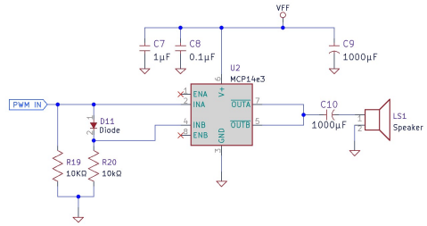
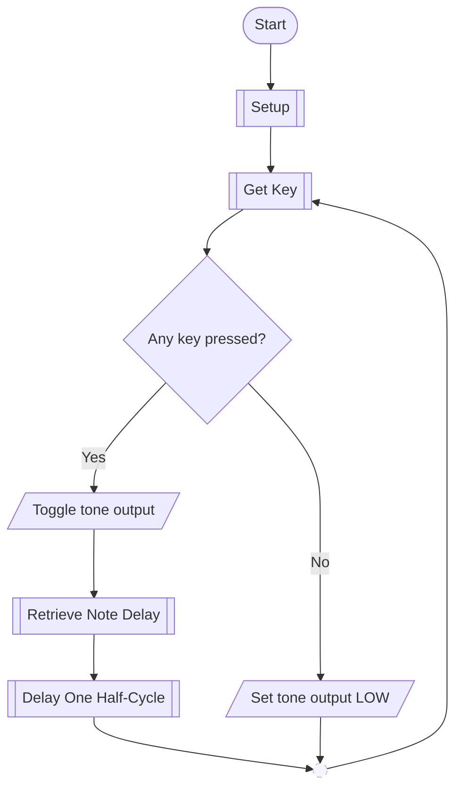

# Lab 05 - Muzak

PIC16F883 | pic-as | Software Timing | Look-Up Tables | Input Polling

## Purpose

Build a reusable software tone generator that converts an active button, switch, or keypad selection into a musical note.

This lab builds directly on earlier work with PIC instruction timing, software delay subroutines, priority input scanning, and matrix keypad scanning. The new work is to organize those pieces into reusable program sections, use a program-memory look-up table to select note timing, and preserve predictable output timing while the processor continues to poll inputs.

The final program should behave as a system of cooperating tasks rather than one large block of note-specific code.

## Standards and references

- [RCET 3375 Lab Standard](../LAB_STANDARD.md)
- [RCET PIC-AS Style Guide](../Notes/RCET_PIC-AS_Style_Guide.md)
- [RCET Flowchart Guide](https://github.com/rosstimo/RCET3371/blob/main/Guides/Flowcharts/RCET-Flowchart-Guide.md)
- [PIC16F883 Data Sheet](https://ww1.microchip.com/downloads/aemDocuments/documents/OTH/ProductDocuments/DataSheets/40001291H.pdf)
- [PICmicro Mid-Range MCU Family Reference Manual](https://ww1.microchip.com/downloads/en/DeviceDoc/33023a.pdf)
- Previous RCET3375 lab-book documentation and source for software delays, priority switch scanning, and matrix keypad scanning

## Equipment and materials

- MPLAB X IDE and pic-as toolchain
- PICkit programmer/debugger
- PIC16F883 circuit
- 4 MHz crystal oscillator circuit
- Oscilloscope
- Frequency counter
- 8-position DIP-switch assembly
- 4 x 4 matrix keypad
- Speaker and Class D driver circuit
- Breadboard, jumpers, resistors, and other interface components as required
- Lab book

## Class D driver

The PIC output provides a logic-level square wave only. Do not attempt to drive the speaker directly from a PIC GPIO pin.

Use the provided Class D driver circuit for the speaker interface.



Before applying power, include the driver and speaker interface in the normal loading and electrical-limit analysis required by the RCET3375 lab standard.

## Program design expectations

Use this lab as an opportunity to make working code reusable.

The final design should separate the major jobs of the program so that changing the input device does not require rewriting the tone-generation system. Useful responsibilities include:

- obtaining the current button, switch, or keypad status;
- converting that physical input into a normalized note-selection value;
- retrieving the delay value associated with that note;
- performing the half-cycle delay;
- controlling the tone output.

Store the current normalized note selection in a general-purpose register of your choosing. Use:

- `0` = no active note / silence;
- a nonzero value = the selected musical note.

The note-selection value should be suitable for use by the look-up process that updates the delay-count value. The delay routine should then use that delay-count value without needing to know which physical input device produced it.

Previously developed routines may be reused and adapted. Do not recreate working input-scanning or delay algorithms simply because they are being used in a new application.

### Output rule

The tone output must remain **logic LOW whenever no valid note-selection input is active**.

Only toggle the tone output while a button, switch, or keypad key is actively requesting a note.

### One generalized note delay

Use the **provided hexadecimal delay value only** for each musical note.

Do not individually tune notes with:

- `NOP` padding;
- alternate note-specific delay paths;
- custom timing code for individual notes;
- modified look-up values chosen to make one particular measured frequency closer to ideal.

The same generalized delay mechanism must be used for every note. Any fixed timing overhead that is part of that common execution path applies to all notes.

> **Hint:** The provided values were chosen to work with one common delay mechanism. Compare the relationship between the count values and the required half-cycle times before designing anything note-specific.

## Supplied top-level flowchart

The following chart shows the intended **main-program architecture only**. It deliberately does not show how the subprocesses are implemented.

[Open this flowchart in Mermaid Live Editor](https://mermaid.live/edit#pako:eNplk1GPmkAUhf_KzSSbuAkqooDy0MauxCbrillpmi36MIWrUoEhw9CWqv-9w6CWbHlh5sw9516-MCcSsgiJQ3YJ-xUeKBfgf9pkIJ-1P331O8FaSHH7eNVc_8sqCNYoyny7bbS56z-7b0EwRwHPWN1kqZ2mWQVHrCDnWBQYfbw0R743ny_coO-z_T5BECxDYKXIS9G_mpee7wbBKwoe40-EJRMIM0zoPX3mLqayp9LAk_7PNNl1n6owwVvJwvsa9OWk7fxavPV4eJA7bwVxAQfk9RiQ0qN8HxBqGiCjpQtkJM2Q30K9VacDj5JHixJ0ux8aNi1MSmzgtEEpWWl3TrV0fsPifCXTpqTKaxz_wChJAWixUGI93fvcJTvXX31n8l-hgvB-VglnGv0oC6FwJIwdge3UWpXnVBwgZOn3WJKBxlKIKrkes5yGsagcvWdqheDsiN2IFvLv4rRywASTaGTP44g4gpeokRR5SustOdVZGyIbpbghjlxGuKNlIjZkk12kLafZN8bSm5Ozcn8gzo4mhdyVeUQFzmK65zS9qxyzCPkTKzNBnIGhGyqFOCfymziGZfd027TMoW5bA3sw0Uglqwbj3nBoWBNT1-2hMTKMi0b-qL56z7L1sTEZjGzTNo3xyNYIRrFg_KW5SepCaYSWgq2rLGwmvfwFWPwE7g)



Use the RCET Flowchart Guide when developing the child flowcharts for the subprocesses. The supplied chart is an architectural starting point, not a replacement for documenting the algorithms you design or adapt.

---

# Part 1 - Generate and Amplify a Single Tone

### Goal

Generate a nominal 1.000 kHz, approximately 50% duty-cycle square wave and reproduce it only while a button is actively pressed. Drive the speaker through the provided Class D circuit and verify the waveform with test equipment.

### Before Lab

Start from the software-timing knowledge and reusable delay work developed in the previous delay lab.

Prepare the circuit and program so that:

- the tone output is logic LOW when the button is not pressed;
- the button status is read continuously;
- the active/inactive button condition is stored in a general-purpose register;
- the same program path repeatedly toggles the output and delays one half-cycle while the button remains active;
- the delay is implemented as reusable logic rather than embedded repeatedly in the main loop.

Using the nominal value:

$$
T_{CY}=1\ \mu s
$$

calculate the required period and half-period for a nominal 1.000 kHz square wave.

Account for the instructions that execute between output transitions. Do not treat the delay subroutine as though it were the only code consuming time.

Use the measured instruction-cycle time from the previous delay lab to predict the expected real output frequency of the same program on your processor.

Prepare or reference:

- schematic and Class D interface documentation;
- applicable PIC SFR documentation;
- loading calculations and electrical-limit checks;
- top-level flowchart and any needed child flowcharts;
- timing calculations;
- source code.

Reference unchanged work from previous labs rather than copying it.

### In the Lab

1. Build and program the circuit.
2. Verify that the tone output remains LOW when the button is not pressed.
3. Press and hold the button and verify that the tone output toggles continuously.
4. Measure PW, PS, period, frequency, and duty cycle with the oscilloscope.
5. Measure frequency with the frequency counter.
6. Compare the measurements with both the nominal prediction and the prediction based on the previously measured instruction-cycle time.
7. Listen to the amplified output and verify that pressing and releasing the button starts and stops the tone cleanly.
8. Document troubleshooting changes.

### Evidence

Include or reference:

- circuit schematic and Class D interface;
- loading/electrical analysis;
- flowchart set;
- final source;
- nominal timing calculations;
- expected timing using the previously measured instruction-cycle time;
- oscilloscope capture and measurements;
- frequency-counter measurement;
- comparison of predicted and measured behavior;
- verification that no active button forces the output LOW;
- troubleshooting notes.

### Demonstrate

Demonstrate the button-gated tone using the oscilloscope, frequency counter, and speaker.

Be prepared to explain:

- why a square-wave output requires a half-cycle delay between transitions;
- which instructions contribute to the measured half-cycle time;
- how the input status is represented in the program;
- why the speaker requires the external driver circuit;
- why the output is explicitly forced LOW when no note is active.

### Complete When

Part 1 is complete when the nominal 1 kHz tone has been predicted, generated, measured, compared with the expected real timing, reproduced only while the button is active, and demonstrated through the Class D speaker driver.

---

# Part 2 - Select Notes with DIP Switches and a Look-Up Table

### Goal

Reuse the priority switch-scanning work from the earlier PIC lab to select musical notes, retrieve the associated hexadecimal delay value from a program-memory look-up table, and generate each selected note with one generalized delay mechanism.

### Note selection

Use the eight DIP switches to select the first eight notes.

| Switch | Note index | Note | Frequency (Hz) | Delay value (Hex) |
| ---: | ---: | --- | ---: | ---: |
| RB0 | 1 | C3 | 130.81 | EE |
| RB1 | 2 | D3 | 146.83 | D4 |
| RB2 | 3 | E3 | 164.81 | BD |
| RB3 | 4 | F3 | 174.61 | B2 |
| RB4 | 5 | G3 | 196.00 | 9F |
| RB5 | 6 | A3 | 220.00 | 8E |
| RB6 | 7 | B3 | 246.94 | 7E |
| RB7 | 8 | C4 | 261.63 | 77 |

If no switch is active, the normalized note-selection value must be `0` and the tone output must remain LOW.

If multiple switches are active, the **highest musical note** has priority. With the assignment above, that also means the highest active note index wins.

### Before Lab

Reuse and adapt the priority-switch scanning algorithm developed previously. The input-scanning portion should determine the active note and store the normalized note index in a general-purpose register.

Create a program-memory look-up table that uses the note index to retrieve the provided hexadecimal delay value.

A computed look-up using `PCL` and `RETLW` is appropriate. Research and document any PIC program-counter behavior or SFR information required to use the selected method correctly.

The look-up process should update a delay-count value used by the same generalized half-cycle delay mechanism for every note.

Do **not** modify the provided hexadecimal values. Do **not** create a different delay algorithm for each note.

Before implementing note-specific timing corrections, stop and examine the table and your generalized delay. The intended solution does not require individually tuning eight different frequencies.

Prepare or reference:

- switch schematic and loading analysis;
- applicable SFR and program-counter documentation;
- input-selection and look-up flowcharts;
- final planned source structure;
- expected timing for representative notes using the provided values.

### In the Lab

1. Verify the no-switch condition first. The tone output must remain LOW.
2. Verify each switch individually.
3. Verify that each switch selects the assigned musical note.
4. Test multiple-switch combinations and confirm that the highest musical note wins.
5. Measure at least one low note and one high note using the oscilloscope and frequency counter.
6. Compare the measured frequencies with the listed target frequencies and with the timing expected from your common delay implementation.
7. Observe whether switch polling or program branching introduces measurable instability or timing error.
8. Document troubleshooting changes without individually tuning the notes.

### Evidence

Include or reference:

- switch schematic and loading analysis;
- required SFR/program-counter documentation;
- flowcharts for the reused/adapted input scan and new look-up behavior;
- final source;
- the normalized note-selection representation;
- the program-memory look-up table;
- representative timing analysis showing how the supplied delay value is used by the generalized delay;
- low-note and high-note oscilloscope captures;
- frequency-counter measurements;
- predicted/expected/measured comparison;
- no-switch LOW-output verification;
- multiple-switch priority results;
- troubleshooting notes.

### Demonstrate

Demonstrate note selection with the DIP switches.

The instructor may select individual or multiple switches. Be prepared to:

- identify the selected musical note;
- explain how input status becomes a normalized note index;
- explain how the note index retrieves the delay value;
- explain how the same delay mechanism serves every note;
- demonstrate that no active switch forces the output LOW;
- measure and interpret a selected note frequency.

### Complete When

Part 2 is complete when all eight switches select the assigned notes, multiple-switch priority is deterministic by musical note, the look-up table supplies the provided hexadecimal values to one generalized delay mechanism, representative frequencies have been measured and explained, and silence is guaranteed when no switch is active.

---

# Part 3 - Build the 16-Key Muzak Keyboard

### Goal

Replace the DIP-switch input with the previously developed 4 x 4 keypad scanner while preserving the reusable note-selection, look-up, delay, and output structure.

The purpose of this part is integration. Keypad scanning itself has already been developed and verified in an earlier lab and does not require a separate instructor checkoff here.

### Keypad note assignment

Assign notes in ascending musical order following the physical adjacency of the keypad:

```text
1   2   3   A
4   5   6   B
7   8   9   C
*   0   #   D
```

Use this mapping:

| Physical key | Note index | Note | Frequency (Hz) | Delay value (Hex) |
| --- | ---: | --- | ---: | ---: |
| 1 | 1 | C3 | 130.81 | EE |
| 2 | 2 | D3 | 146.83 | D4 |
| 3 | 3 | E3 | 164.81 | BD |
| A | 4 | F3 | 174.61 | B2 |
| 4 | 5 | G3 | 196.00 | 9F |
| 5 | 6 | A3 | 220.00 | 8E |
| 6 | 7 | B3 | 246.94 | 7E |
| B | 8 | C4 | 261.63 | 77 |
| 7 | 9 | D4 | 293.66 | 6A |
| 8 | 10 | E4 | 329.63 | 5E |
| 9 | 11 | F4 | 349.23 | 59 |
| C | 12 | G4 | 392.00 | 4F |
| * | 13 | A4 | 440.00 | 47 |
| 0 | 14 | B4 | 493.88 | 3F |
| # | 15 | C5 | 523.25 | 3B |
| D | 16 | D5 | 587.33 | 35 |

The physical label printed on the key no longer determines priority.

If multiple keys are detected, the **highest assigned musical note** must win. The keypad-scanning logic should therefore produce the highest active **note index**, not the numerically or alphabetically largest printed keypad character.

### Before Lab

Reuse the matrix keypad circuit, electrical analysis, scan-state work, and scanning algorithm developed previously. Reference unchanged lab-book pages and source instead of recreating them.

Adapt the keypad result so that the input-handling portion of the program stores the normalized musical note index shown in the table above.

The rest of the tone-generation path should continue to operate from that normalized value:

```text
physical keypad
      ↓
normalized note selection
      ↓
provided hexadecimal delay value
      ↓
generalized half-cycle delay
      ↓
tone output
```

Changing from DIP switches to the keypad should not require redesigning the complete tone-generation system.

Review the multiple-key electrical concern from the earlier keypad lab before testing simultaneous key presses. Any previously required protection remains required unless the circuit has been redesigned and reanalyzed.

Update the flowchart set so that it accurately describes the final program and its subprocesses.

Do not create note-specific delay corrections. Use the supplied hexadecimal table values and the same generalized delay mechanism used in Part 2.

### In the Lab

1. Connect the keypad using the previously verified interface.
2. Confirm that no key pressed forces the tone output LOW.
3. Verify each of the 16 keys individually.
4. Confirm that physically adjacent keys produce the expected ascending note sequence shown in the assignment.
5. Verify multiple-key behavior only after the electrical current paths are known to be safe.
6. Confirm that the highest active musical note has priority.
7. Measure at least one low note and one high note with the oscilloscope and frequency counter.
8. Observe the output while the keypad is being scanned. Determine how input polling, selection logic, look-up activity, branching, and subroutine overhead affect the half-cycle timing.
9. Compare the measured frequencies with the target values and with the behavior of the generalized delay implementation.
10. Document troubleshooting and integration changes.

### Evidence

Include or reference:

- keypad schematic and multiple-key electrical analysis from the earlier lab;
- any changed schematic or loading work;
- updated flowchart set;
- final source;
- key-to-note mapping;
- normalized note-selection behavior;
- verification of all 16 keys;
- multiple-key highest-note priority results;
- low-note and high-note oscilloscope captures;
- frequency-counter measurements;
- explanation of how keypad polling and other program overhead affect tone timing;
- confirmation that all notes use the supplied hexadecimal values and one generalized delay path;
- verification that no active key forces the output LOW;
- troubleshooting notes.

### Demonstrate

Play all 16 notes reliably from the keypad.

The instructor may press individual or multiple keys. Be prepared to:

- identify the expected note from its physical key position;
- demonstrate highest-musical-note priority;
- demonstrate immediate silence when no key is active;
- explain what changed when the DIP-switch input was replaced by the keypad;
- identify which parts of the tone-generation program were reused unchanged;
- explain how the selected key becomes the delay value used by the common delay routine;
- measure and interpret a selected output frequency;
- explain the effect of polling and program overhead on the generated tone.

### Complete When

Part 3 is complete when all 16 physical keys produce the assigned notes, adjacent keys follow the intended musical sequence, highest-note priority works safely and deterministically, no-key behavior forces the output LOW, the same look-up/delay architecture serves every note, representative timing has been measured and explained, and the complete keyboard has passed the instructor checkoff.

---

# Part 5 - Mastery

TBD.

Part 5 is optional and is reserved for a later mastery challenge. Complete Parts 1-3 first.
