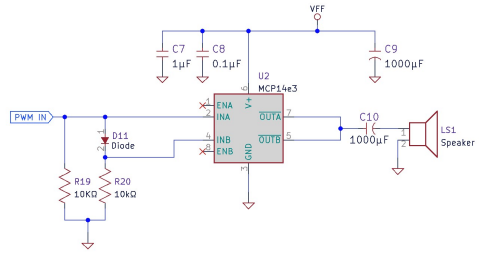

# Lab 05 – Funky Muzak
PIC16F883 • pic-as • Timing + Look-Up Tables + Input Polling

---

## Equipment / Materials
- MPLAB X IDE + XC8 / `pic-as`
- Programmer/debugger (PICkit or equivalent)
- Oscilloscope (**required**)
- Frequency counter (**strongly recommended**)
- Breadboard + jumpers
- 4x4 keypad
- DIP switch bank (at least 3 switches, more is fine)
- Speaker + Class D driver circuit (per provided schematic)
- Lab notebook

---

## Core Objectives
By the end of this lab, you will be able to:
1. Generate an **exact 1 kHz** square wave on a pin using software timing.
2. Build and use a **look-up table** (LUT) to convert an input “note selection” into a delay value.
3. Maintain a stable output frequency while **polling DIP switches**.
4. Maintain a stable output frequency while **scanning a 4x4 keypad**.
5. Verify timing with an oscilloscope and explain differences between “calculated” and “measured.”

---

## Background Notes
This lab is about **timing discipline**:
- Generate a stable square wave at a target frequency
- Use a **look-up table** of delay values to produce different notes
- Keep your output pin toggling at the correct rate **while polling inputs**
- Integrate a 4x4 keypad scan without wrecking your waveform

In other words: you will learn how software timing falls apart the moment you add “one more thing.”
### Instruction cycle timing
For midrange PICs, the instruction cycle is typically:
- `TCY = 4 / FOSC`

Your delay routines must be based on **instruction cycles** because oscillator frequency may vary.

### “Class D amplifier” notes
You are using an external driver/amplifier because:
- A PIC GPIO pin is not a speaker driver.
- The driver IC + MOSFET stage provides current drive and switching power behavior.
- The series capacitor blocks DC to the speaker.
- Your microcontroller pin provides a logic-level square wave only.

You do **not** need to write a full amplifier theory essay for this lab. You do need to wire it correctly and not cook the MCU.

---

# Part 1 – 1 kHz Tone (Button-Gated)
**Goal:** Prove you can generate a clean 1 kHz square wave at the amplifier input.

## Part 1 Objectives
1. Wire the amplifier input node (**PWM IN**) to **RA0** (or the lab-standard output pin).
2. Select a button input pin (recommended: **RB0**, active-low with pull-up).
3. Output a **1.000 kHz** square wave (≈50% duty) **only while the button is pressed**.
4. Capture the waveform and measure frequency/period.

## Required Behavior
- Button not pressed: output pin forced low (silence)
- Button pressed: output pin toggles continuously at 1 kHz
- Your code must poll the button while running (do not “freeze” the program in a giant delay that ignores input for seconds)

## Calculations
- Show:
  - `FOSC`
  - `TCY`
  - Half-period target for 1 kHz: `0.5 ms`
- Show the cycle math for your delay routine (or calibrated loop structure).

## Measurements
- Oscilloscope capture of RA0 (or PWM IN) showing:
  - Frequency near 1.000 kHz
  - Duty cycle at 50%
  - At least one full cycle with readable scale
- Record measured frequency and compare to your calculated expectation.

## Instructor Checkpoint
Demonstrate:
- Button-gated 1 kHz tone
- Measured frequency shown on the scope and frequency counter

---

# Part 2 – DIP Switch Notes (First 8 Notes via LUT)
**Goal:** Get the LUT + note timing working *before* the keypad scan timing chaos.

## Part 2 Objectives
1. Use DIP switches on **PORTB** to select one of the first 8 notes from the table.
2. Implement a **look-up table** returning a delay value for the selected note.
3. Toggle the output pin (RA0) at the correct frequency for the selected note.
4. Poll the DIP switches continuously while generating the tone.

## DIP Switch Input Definition (Required)
Use:
- `RB0:RB7` as a priority encoded note select:
  - `0x00` = silence
  - `0x01` = Note 1 (C3)
  - `0x02` = Note 2 (D3)
  - ...
  - `0x07` = Note 7 (B3)

- If multiple switches are on, the highest-priority (highest-numbered) switch determines the note.

## LUT Requirement (Required Implementation)
Your delay values must be stored in a LUT in program memory, e.g.:
- computed jump (`ADDWF PCL`) + `RETLW` values

The main loop structure must be:
1. Read DIP switch selection
2. Determine highest-priority switch
   - Convert selection → LUT index
   - Fetch delay value from LUT
   - Toggle output pin
   - Delay using fetched value
3. If no switch: force output low (silence)
4. Repeat

**Important:** I/O polling consumes time. That time affects your period. You must account for it.

## First 8 Notes Table
(From the original handout table)

| Select | Note | Frequency (Hz) | Table Value (Hex) | Dec |
|---:|---|---:|---:|---:|
| 1 | C3 | 130.81 | EE | 238 |
| 2 | D3 | 146.83 | D4 | 212 |
| 3 | E3 | 164.81 | BD | 189 |
| 4 | F3 | 174.61 | B2 | 178 |
| 5 | G3 | 196.00 | 9F | 159 |
| 6 | A3 | 220.00 | 8E | 142 |
| 7 | B3 | 246.94 | 7E | 126 |

## Timing Constraint
Your waveform must remain stable while DIP switches are being polled.
- If your polling or branching causes jitter, you will see it on the scope.
- You must decide *where* in the toggle/delay loop you sample inputs.

## Measurements
- Show at least **two measured note frequencies**:
  - One low note (ex: C3)
  - One higher note (ex: B3)
- Record measured frequency vs expected.
- Oscilloscope captures showing stable waveform and readable frequency.
- Frequency counter measurements.

## Instructor Checkpoint
Demonstrate:
- DIP switches select notes
- Output frequency changes correctly
- Measured waveforms are stable and free of jitter
- You can explain how the LUT indexing works
- Be prepared to measure and verify frequencies on the scope
---

# Part 3 – 4x4 Keypad Piano (All 16 Notes)
**Goal:** Integrate keypad scanning while keeping tone timing under control.

## Part 3 Objectives
1. Scan a 4x4 keypad and determine which key is pressed (0–15).
2. Use a LUT to convert key number → delay value.
3. Toggle RA0 to generate the note while the key is held.
4. Demonstrate all 16 notes.

## Wiring Suggestion (Recommended)
For the final stage, remove the DIP switches and use PORTB for the keypad:

- `RB3:RB0` = row outputs (be sure output do not short out when more than one key is pressed; use diodes or some other method to prevent damage to the PIC) 
- `RB7:RB4` = column inputs (with pull-ups enabled or external resistors)

If your lab hardware uses a different port mapping, that’s fine, but your schematic and code must match.

## Required Behavior
- No key pressed: output low (silence)
- Key pressed: play the corresponding note continuously while held
- Multiple keys pressed: choose and document one behavior:
  - first-detected wins
  - lowest-numbered wins
  - ignore until a single key is pressed

## Program Flow
Your top-level loop must follow this pattern:
1. Scan keypad
2. If key pressed:
   - key → LUT index
   - fetch delay value
   - toggle output
   - delay
3. If no key:
   - force output low
4. Repeat

**Important:** keypad scanning consumes time. That time affects your period unless you account for it.
You are expected to see and deal with this.

## Full 16-Note Table (Use these values)
(From the original handout table)

| Key | Note | Frequency (Hz) | Table Value (Hex) | Dec |
|---:|---|---:|---:|---:|
| 1 | C3 | 130.81 | EE | 238 |
| 2 | D3 | 146.83 | D4 | 212 |
| 3 | E3 | 164.81 | BD | 189 |
| 4 | F3 | 174.61 | B2 | 178 |
| 5 | G3 | 196.00 | 9F | 159 |
| 6 | A3 | 220.00 | 8E | 142 |
| 7 | B3 | 246.94 | 7E | 126 |
| 8 | C4 | 261.63 | 77 | 119 |
| 9 | D4 | 293.66 | 6A | 106 |
| 10 | E4 | 329.63 | 5E | 94 |
| 11 | F4 | 349.23 | 59 | 89 |
| 12 | G4 | 392.00 | 4F | 79 |
| 13 | A4 | 440.00 | 47 | 71 |
| 14 | B4 | 493.88 | 3F | 63 |
| 15 | C5 | 523.25 | 3B | 59 |
| 16 | D5 | 587.33 | 35 | 53 |

## Measurements
- Oscilloscope capture of:
  - One low note and one high note
  - Record measured frequency vs expected
- Frequency counter measurements for the same notes

## Instructor Final Checkoff
🎵 Play all 16 notes from the keypad reliably. 🎵

---

## Submission Requirements (All Parts)
Your lab notebook / submission must include:
- Schematic(s) for each stage (Part 1, Part 2, Part 3)
- Loading calculations for all components, I/O pins etc.
- Delay routine calculations for all notes (show all math with explanations)
- Flowchart immediately before code listing
- Code listing with comments explaining:
  - LUT indexing method
  - delay routine
  - keypad scan method
- Required oscilloscope screenshots and measured frequencies
- Short analysis: what broke, what you changed, and what finally made it work
## Final Analysis (Conclusion)
- Discussion of timing discipline: how did you account for the time taken by input polling and branching?
- Look-up tables: Pros and Cons of directly writing to the program counter.

