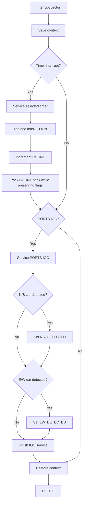
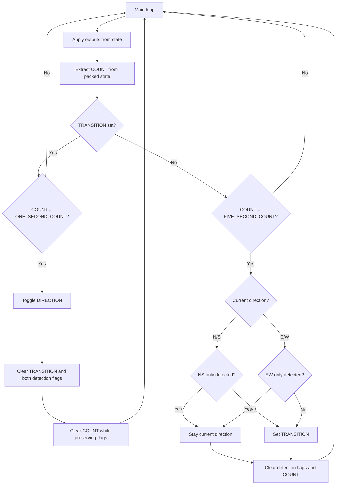

<a id="top"></a>

# RCET 3375 Lab 06 - Timers and Event-Driven State

[RCET3375 course home](../README.md)

PIC16F883 | pic-as | Hardware Timers | Interrupt Timing | Packed State | PORTB IOC | Traffic Control

## Contents

- [Purpose](#purpose)
- [Standards and references](#standards-references)
- [Equipment and materials](#equipment-materials)
- [Part 1 - 20 ms timer proof of life](#part-1)
- [Part 2 - Timed intersection state machine](#part-2)
- [Part 3 - Interrupt-driven intersection state machine](#part-3)
- [Part 4 - Car-detection state machine](#part-4)
- [Part 5 - Mastery](#part-5)
- [Submission and checkoff](#submission)

<a id="purpose"></a>
## Purpose

Build a traffic-signal controller that uses timed phases and car-detection inputs to decide when traffic should continue in the current direction and when the intersection should change directions.

Normal operation uses a **5-second green interval** and a **1-second yellow transition**. Later in the lab, car-detection sensors allow the controller to respond to traffic activity instead of changing directions blindly at the end of every green interval.

You will use hardware timers to create the required timing and explore the idea of a **state machine** to keep track of what the intersection is doing and what has happened during the current timing interval.

Part 1 begins with a smaller timer exercise so you can measure timer-interrupt behavior directly before applying timers to the intersection.

[Back to top](#top) · [Course home](../README.md)

<a id="standards-references"></a>
## Standards and references

- [RCET 3375 Lab Standard](../LAB_STANDARD.md)
- [RCET PIC-AS Style Guide](../Notes/RCET_PIC-AS_Style_Guide.md)
- [RCET 3373 PIC16F883 Timers](https://github.com/rosstimo/RCET3373/blob/main/Topics/timers.md)
- [RCET Flowchart Guide](https://github.com/rosstimo/RCET3371/blob/main/Guides/Flowcharts/RCET-Flowchart-Guide.md)
- [PIC16F882/883/884/886/887 Data Sheet](https://ww1.microchip.com/downloads/aemDocuments/documents/OTH/ProductDocuments/DataSheets/40001291H.pdf)
- [PICmicro Mid-Range MCU Family Reference Manual](https://ww1.microchip.com/downloads/en/DeviceDoc/33023A.pdf)
- previous RCET3375 lab-book documentation and source for interrupts, context saving, digital I/O, masking, and measurement

The PIC16F883 data sheet and the Family Reference Manual are the authority for timer operation, interrupt flags/enables, PORTB interrupt-on-change behavior, register settings, reset states, and electrical limits.

[Back to top](#top) · [Course home](../README.md)

<a id="equipment-materials"></a>
## Equipment and materials

- MPLAB X IDE and pic-as toolchain
- PICkit programmer/debugger
- PIC16F883 circuit
- 4 MHz crystal oscillator circuit
- six LEDs for the two traffic signals
- current-limiting resistors
- two digital car-detection inputs for Parts 3-4
- oscilloscope
- frequency counter or logic analyzer, optional
- breadboard, jumpers, and interface components as required
- lab book

[Back to top](#top) · [Course home](../README.md)

<a id="part-1"></a>
## Part 1 - 20 ms Timer Proof of Life

### Goal

Configure one PIC16F883 hardware timer to generate a periodic interrupt every **20 ms nominal**.

Use two diagnostic PORTA outputs to measure both the timer interrupt and the effect of the interrupt on main-loop execution.

For the course 4 MHz oscillator:

```text
FOSC = 4 MHz
FCY  = FOSC / 4 = 1 MHz
TCY  = 1 us
```


### Required diagnostic signals

Choose two available digital PORTA outputs and document them.

**Timer diagnostic pulse**

For every timer interrupt:

1. service the timer as required by your design;
2. drive the timer diagnostic output HIGH;
3. drive it LOW on the immediately following instruction.

The pulse should be as short as practical. The two output instructions should be adjacent, equivalent to:

```text
BSF PORTA,x
BCF PORTA,x
```

This produces one short diagnostic pulse every 20 ms.

**Main-loop diagnostic**

In main, continuously toggle the second PORTA diagnostic bit with no intentional delay.

The main-loop signal should make it easy to see where normal execution is interrupted and where it resumes.

### Timer-period boundary

Define **exactly** what marks the beginning of a new timer period for your chosen timer.

Place the rising edge of the timer diagnostic pulse as close as practical to that period boundary.

Then determine exactly how far the diagnostic rising edge leads or lags the timer-period boundary.

Do not assume the GPIO edge and the hardware timer event occur at the same instant.

### Required behavior

- 20 ms periodic timer interrupt.
- One very short PORTA diagnostic pulse per timer interrupt.
- A second PORTA diagnostic bit toggling continuously in main.
- Correct interrupt context save/restore.
- Correct timer flag service and reload/configuration behavior.
- No software-delay loop used to generate the timer period.
- Main resumes normally after every timer interrupt.

### Before Lab

Prepare:

- timer choice and reason;
- complete timer calculation;
- timer and interrupt SFR documentation;
- timer-period boundary definition;
- predicted timer diagnostic period;
- predicted instruction-cycle offset from the timer-period boundary to the diagnostic rising edge;
- selected PORTA diagnostic pins;
- main/ISR flowchart;
- source code.

### In the Lab

1. Verify the main-loop diagnostic signal before enabling the timer interrupt.
2. Enable the timer and verify one timer diagnostic pulse every 20 ms.
3. Display both PORTA diagnostic signals on the oscilloscope.
4. Observe where timer interrupt service disturbs the otherwise continuous main-loop diagnostic activity.
5. Measure the timer diagnostic pulse spacing.
6. Compare measured timing with the predicted 20 ms period.
7. Compare the observed diagnostic rising edge with your calculated timer-period boundary.
8. Explain the instruction path that creates the measured lead or lag.

The shortest diagnostic pulse may be difficult to trigger on or display cleanly. If measurement limitations require you to temporarily widen the pulse, change the test conditions, or use another instrument configuration, document:

- what was difficult to measure;
- what you changed;
- why the change was justified;
- whether the change affects the timing quantity being evaluated.

The final timing conclusion must still refer to the actual program behavior.

### Evidence

Include or reference:

- complete timer calculation;
- timer SFR documentation;
- main/ISR flowchart;
- final source;
- scope capture showing the short timer diagnostic pulse;
- scope capture showing main execution interrupted by timer service;
- measured 20 ms period;
- predicted versus measured timing;
- instruction-cycle calculation for diagnostic rising-edge lead/lag;
- measurement difficulties and any justified test modifications;
- troubleshooting record.

### Demonstrate

Show both diagnostic signals simultaneously.

Be prepared to trace execution from the timer event through interrupt entry, context save, timer service, diagnostic pulse, context restore, and return to main.

### Complete When

Part 1 is complete when the timer produces an accurately measured 20 ms periodic interrupt, both diagnostic signals clearly show timer and main execution, and you can account for the timer diagnostic rising-edge offset in instruction cycles and microseconds.

[Back to top](#top) · [Course home](../README.md)

<a id="part-2"></a>
## Part 2 - Timed Intersection State Machine

### Goal

Use the packed `COUNT`, `DIRECTION`, and `TRANSITION` fields from Part 3 to operate the intersection continuously without car-detection logic.

The selected direction remains green for 5 seconds. The transition lasts 1 second.

### Required timing

Normal operation alternates:

```text
N/S green, E/W red       5 seconds
N/S yellow, E/W red      1 second
N/S red, E/W green       5 seconds
N/S red, E/W yellow      1 second
repeat
```

Main evaluates `COUNT` and the state flags.

The selected timer continues to increment COUNT once per interrupt.

### State-machine rules

When `TRANSITION = 0`:

1. the direction selected by `DIRECTION` is green;
2. main keeps evaluating `COUNT`;
3. when `COUNT = FIVE_SECOND_COUNT`:
   - set `TRANSITION`;
   - clear `COUNT`;
   - leave `DIRECTION` unchanged.

When `TRANSITION = 1`:

1. the direction selected by `DIRECTION` is yellow;
2. main keeps evaluating `COUNT`;
3. when `COUNT = ONE_SECOND_COUNT`:
   - toggle `DIRECTION`;
   - clear `TRANSITION`;
   - clear `NS_DETECTED` and `EW_DETECTED`;
   - clear `COUNT`;
   - begin a fresh 5-second green interval.

There is no state evaluation at the end of the 1-second transition. The transition simply finishes.

The timer ISR never decides whether the light should be green or yellow. It only updates COUNT.

### Before Lab

Prepare:

- complete main state-machine flowchart;
- source code;
- packed-field operations used to test and clear COUNT;
- expected traffic sequence;
- expected measured state durations.

### In the Lab

1. Start with N/S green and COUNT = 0.
2. Verify N/S remains green until COUNT reaches your calculated `FIVE_SECOND_COUNT`.
3. Verify the state changes to N/S yellow and COUNT resets.
4. Verify the yellow transition ends when COUNT reaches your calculated `ONE_SECOND_COUNT`.
5. Verify DIRECTION changes only after the transition finishes.
6. Repeat the sequence for E/W.
7. Observe several complete cycles.
8. Measure at least one 5-second interval and one 1-second interval.
9. Verify that no state change creates conflicting green outputs.

### Evidence

Include or reference:

- main state-machine flowchart;
- final source;
- COUNT/state traces or observations through at least one complete cycle;
- measured 5-second green interval;
- measured 1-second yellow interval;
- troubleshooting record.

### Demonstrate

Show continuous normal intersection timing with no car-detection inputs.

Be prepared to explain:

- why COUNT is part of the state byte;
- why the ISR increments COUNT but main evaluates it;
- why COUNT is reset at each state boundary;
- why DIRECTION does not change until the 1-second transition finishes.

### Complete When

Part 2 is complete when the intersection alternates indefinitely with accurate 5-second green and 1-second yellow timing, the `COUNT` field is reset at the correct state boundaries, and no invalid traffic-light state occurs.

[Back to top](#top) · [Course home](../README.md)

<a id="part-3"></a>
## Part 3 - Interrupt-Driven Intersection State Machine

### Goal

Build and demonstrate the traffic-light state machine **without using a hardware timer**.

Use the dedicated external interrupt as a manual state-advance event. Each valid external interrupt increments a 4-bit `STATE_COUNT` field in `intersection_state`.

Use PORTB interrupt-on-change to latch car-detection events. Main evaluates the packed state and decides whether the current traffic direction remains green or begins a yellow transition.

The purpose of this part is to make the state-machine logic observable one event at a time before timing is added later.

### Required state register

Use one GPR named `intersection_state`.

Choose and document its GPR address.

Use this register map:

| Bit | 7 | 6 | 5 | 4 | 3 | 2 | 1 | 0 |
| --- | --- | --- | --- | --- | --- | --- | --- | --- |
| Name | SC3 | SC2 | SC1 | SC0 | TRANSITION | EW_DETECTED | NS_DETECTED | DIRECTION |

The upper nibble is a 4-bit `STATE_COUNT` field. 
The lower nibble contains the intersection flags.

| Field | Meaning |
| --- | --- |
| `STATE_COUNT[3:0]` | current manual state-machine count |
| `DIRECTION` | 0 = N/S direction; 1 = E/W direction |
| `NS_DETECTED` | a low-to-high N/S car-detection event has been latched |
| `EW_DETECTED` | a low-to-high E/W car-detection event has been latched |
| `TRANSITION` | 0 = selected direction is green; 1 = selected direction is yellow |

### Initial state

Begin with:

- `STATE_COUNT = 0`;
- `DIRECTION = 0` for N/S;
- `TRANSITION = 0`;
- both car-detection flags clear;
- N/S green;
- E/W red.

### External state-advance interrupt

Use the dedicated external interrupt as the state-advance input.

Each valid external interrupt must increment only `STATE_COUNT` in bits 7:4 of `intersection_state`.

The lower four state flags must remain unchanged by the increment.

Document the external-interrupt configuration and the masks/operations used to:

- extract `STATE_COUNT`;
- increment it;
- place the updated value back into bits 7:4;
- preserve bits 3:0.

### PORTB car detection

Use PORTB interrupt-on-change for two car-detection inputs:

- N/S car detection;
- E/W car detection.

A **low-to-high** change on the N/S sensor sets `NS_DETECTED`.

A **low-to-high** change on the E/W sensor sets `EW_DETECTED`.

Once set, a car-detection flag remains set until the state machine clears it. Repeated detections in the same direction do not count additional cars; the corresponding flag simply remains set.

### Traffic-light outputs

Use PORTC to drive all six traffic-light LEDs:

- N/S red;
- N/S yellow;
- N/S green;
- E/W red;
- E/W yellow;
- E/W green.

You choose and document the six PORTC bit assignments unless the instructor assigns them.

Document the exact PORTC value for each legal normal traffic-light state:

| DIRECTION | TRANSITION | N/S lights | E/W lights | PORTC value |
| ---: | ---: | --- | --- | --- |
| 0 | 0 | Green | Red | bit pattern TBD |
| 0 | 1 | Yellow | Red | bit pattern TBD |
| 1 | 0 | Red | Green | bit pattern TBD |
| 1 | 1 | Red | Yellow | bit pattern TBD |

No other normal traffic-light combination is allowed.

### State-count decisions

Main must examine `STATE_COUNT` and decide what action or test is required.

The required decision points are:

| STATE_COUNT | Required behavior |
| ---: | --- |
| 0 | no state change |
| 1 | no state change |
| 3 | evaluate `DIRECTION`, `NS_DETECTED`, and `EW_DETECTED` to decide whether to stay green or begin a transition |
| 4 | finish an active transition |

`STATE_COUNT = 2` is deliberately not assigned a special transition action here. Your flowchart and code must still account for it and keep the current state and outputs valid.

The field is four bits wide, but this part does not require using all possible values. Your design must prevent unused count values from creating an invalid traffic-light state.

### End-of-green decision at STATE_COUNT = 3

At `STATE_COUNT = 3`, use the current direction and both car-detection flags to decide whether the light changes.

Develop the decision logic based on the following rules:

For N/S green:

| N/S detected | E/W detected | Action |
| ---: | ---: | --- |
| 1 | 0 | remain N/S green |
| 0 | 1 | begin N/S yellow transition |
| 1 | 1 | begin N/S yellow transition |
| 0 | 0 | begin N/S yellow transition |

For E/W green:

| N/S detected | E/W detected | Action |
| ---: | ---: | --- |
| 0 | 1 | remain E/W green |
| 1 | 0 | begin E/W yellow transition |
| 1 | 1 | begin E/W yellow transition |
| 0 | 0 | begin E/W yellow transition |

If the decision is **do not change direction**:

- clear `STATE_COUNT`;
- clear `NS_DETECTED`;
- clear `EW_DETECTED`;
- continue displaying the current green state.

If the decision is **change direction**:

- set `TRANSITION`;
- the current direction changes from green to yellow.

The next valid external state-advance interrupt increments `STATE_COUNT` from 3 to 4.

### Transition completion at STATE_COUNT = 4

When `STATE_COUNT = 4`:

- clear `TRANSITION`;
- toggle `DIRECTION`;
- clear `NS_DETECTED`;
- clear `EW_DETECTED`;
- clear `STATE_COUNT`;
- the newly selected direction is green and the opposite direction is red.

### Shared-state warning

The external-interrupt service, PORTB IOC service, and main loop all use `intersection_state`.

Because several parts of the program can modify different fields within the same byte, the packed state byte **can be corrupted** if updates interfere with one another.

Your implementation must prevent state corruption. Determine and document your own solution.

### Before Lab

Prepare or reference:

- external-interrupt input circuit and configuration;
- two PORTB car-detection inputs and loading/electrical analysis;
- external-interrupt and PORTB IOC SFR documentation;
- `intersection_state` register map;
- masks and packed-field operations for `STATE_COUNT` and the flags;
- PORTC traffic-light register map and all four legal output values;
- complete state-machine flowchart that accounts for every `STATE_COUNT` value your program can encounter;
- source code.

### In the Lab

1. Verify the initial N/S-green state with `STATE_COUNT = 0`.
2. Trigger the external interrupt and verify that only `STATE_COUNT` changes.
3. Advance through the count values and confirm that counts with no required state change leave the traffic outputs unchanged.
4. Verify a low-to-high N/S car-detection event sets `NS_DETECTED`.
5. Verify a low-to-high E/W car-detection event sets `EW_DETECTED`.
6. Verify high-to-low sensor changes do not set the detection flags.
7. Reach `STATE_COUNT = 3` with N/S green and test all four car-detection combinations.
8. Repeat the count-3 decision tests with E/W green.
9. For a stay-green decision, verify that the count and both car flags clear while the direction remains unchanged.
10. For a transition decision, verify that the current direction changes from green to yellow while `STATE_COUNT` remains 3.
11. Trigger one more external interrupt and verify `STATE_COUNT = 4` completes the transition, toggles direction, clears the car flags/count, and updates the lights.
12. Repeat several complete manual state-machine cycles.
13. Stress the design with external-interrupt and IOC events occurring close together and verify the packed state remains valid.

### Evidence

Include or reference:

- external-interrupt and car-detection schematics;
- loading/electrical analysis;
- interrupt and IOC SFR documentation;
- `intersection_state` register map;
- masks and packed-field operations;
- PORTC map and four legal traffic-light values;
- complete state-machine flowchart;
- final source;
- evidence that the external interrupt increments only `STATE_COUNT`;
- evidence that only low-to-high car-detection events latch the corresponding flags;
- results for all count-3 car/direction decision cases;
- evidence of both stay-green and transition paths;
- evidence that count 4 completes the transition correctly;
- evidence that packed state remains valid when interrupt events occur close together;
- troubleshooting record.

### Demonstrate

The instructor may generate external state-advance events and car-detection events in arbitrary sequences.

Be prepared to explain:

- what each field in `intersection_state` represents;
- why the external interrupt changes only `STATE_COUNT`;
- how a low-to-high car-detection event is latched;
- what main checks at `STATE_COUNT = 3`;
- how `DIRECTION` and the car flags determine whether the intersection stays green or begins a transition;
- why `DIRECTION` does not toggle until `STATE_COUNT = 4`;
- how your design handles count values that do not require a state change;
- how you prevent packed-state corruption.

### Complete When

Part 3 is complete when external interrupts advance the state count, PORTB IOC correctly latches low-to-high car detections, main makes the required direction/car decision at count 3, count 4 completes a transition correctly, and the intersection never produces an invalid traffic-light state.

[Back to top](#top) · [Course home](../README.md)

<a id="part-4"></a>
## Part 4 - Car-Detection State Machine

### Goal

Add two PORTB interrupt-on-change car-detection sensors to the Part 2 intersection.

A car-detection event can occur at any point during a normal 5-second green interval. A car may be passing through the detection point rather than waiting at the intersection.

The system records whether at least one detection event occurred in each direction during the current 5-second decision window. It does **not** count cars.

### PORTB car-detection inputs

Use PORTB interrupt-on-change for both required car-detection sensors, building directly on the IOC work from Lab 05.

Document the PORTB bits used for:

- N/S car detection;
- E/W car detection.

You do not need to save or compare a previous PORTB value for this lab.

### Detection-latch behavior

When a car is detected on the N/S sensor, set `NS_DETECTED`.

When a car is detected on the E/W sensor, set `EW_DETECTED`.

Once set, a detection flag remains set until main reaches the appropriate state boundary and clears it.

Setting an already-set detection flag again has no negative effect. The system is recording whether a car was detected during the current decision window, not counting cars.

### End-of-green decision logic

At the end of each 5-second green interval, when `COUNT = FIVE_SECOND_COUNT`, main evaluates `DIRECTION`, `NS_DETECTED`, and `EW_DETECTED`.

The rule is:

> Stay in the current direction only when the current direction is the only direction in which a car was detected. Otherwise, begin the transition to the opposite direction.

For N/S green:

| N/S detected | E/W detected | Action |
| ---: | ---: | --- |
| 1 | 0 | remain N/S for a fresh 5 seconds |
| 0 | 1 | begin N/S yellow transition |
| 1 | 1 | begin N/S yellow transition |
| 0 | 0 | begin N/S yellow transition |

For E/W green:

| N/S detected | E/W detected | Action |
| ---: | ---: | --- |
| 0 | 1 | remain E/W for a fresh 5 seconds |
| 1 | 0 | begin E/W yellow transition |
| 1 | 1 | begin E/W yellow transition |
| 0 | 0 | begin E/W yellow transition |

After the end-of-green evaluation:

- clear `NS_DETECTED`;
- clear `EW_DETECTED`;
- clear `COUNT`.

If the result is a transition:

- set `TRANSITION`;
- leave `DIRECTION` unchanged until the transition finishes.

If the current direction remains green:

- leave `TRANSITION` clear;
- begin a fresh 5-second interval with COUNT = 0 and fresh car-detection flags.

### Transition behavior

While `TRANSITION = 1`:

- the selected direction remains yellow;
- no car-state decision is made;
- the selected timer continues to increment COUNT.

When `COUNT = ONE_SECOND_COUNT`:

- toggle `DIRECTION`;
- clear `TRANSITION`;
- clear `NS_DETECTED` and `EW_DETECTED`;
- clear `COUNT`;
- begin a fresh 5-second green interval.

A car may be detected while the lights are in transition, but those flags are cleared when the transition finishes. Each green interval therefore starts with a fresh car-detection state.

### Part 4 pseudocode

The following pseudocode defines the required control behavior. Translate the behavior into pic-as rather than copying the pseudocode as source.

```text
SETUP:
    configure selected timer for the chosen interrupt interval
    configure PORTB IOC car sensors
    configure PORTC traffic outputs

    clear intersection_state

    DIRECTION = N/S
    TRANSITION = 0
    COUNT = 0

    apply traffic outputs from intersection_state
    enable interrupts

COMMON ISR:
    save context

    if selected timer interrupt flag is set:
        service/reload/clear selected timer as required

        grab intersection_state
        extract COUNT with a mask
        increment COUNT
        mask COUNT to four bits
        pack COUNT back into bits 7:4
        preserve bits 3:0
        write intersection_state

    if PORTB IOC flag is set:
        service PORTB IOC as required

        if N/S car is detected:
            set NS_DETECTED

        if E/W car is detected:
            set EW_DETECTED

    restore context
    return from interrupt

MAIN LOOP:
    apply traffic outputs from intersection_state

    grab intersection_state
    extract COUNT with a mask

    if TRANSITION == 1:
        if COUNT is not ONE_SECOND_COUNT:
            repeat MAIN LOOP

        toggle DIRECTION
        clear TRANSITION
        clear NS_DETECTED
        clear EW_DETECTED
        clear COUNT while preserving flags
        repeat MAIN LOOP

    ; TRANSITION == 0, so selected direction is green

    if COUNT is not FIVE_SECOND_COUNT:
        repeat MAIN LOOP

    ; 5-second green interval has ended

    if DIRECTION == N/S:
        if NS_DETECTED == 1 AND EW_DETECTED == 0:
            stay_current_direction = true
        else:
            stay_current_direction = false

    if DIRECTION == E/W:
        if EW_DETECTED == 1 AND NS_DETECTED == 0:
            stay_current_direction = true
        else:
            stay_current_direction = false

    clear NS_DETECTED
    clear EW_DETECTED
    clear COUNT while preserving flags

    if stay_current_direction == true:
        clear TRANSITION
    else:
        set TRANSITION

    repeat MAIN LOOP
```

### Part 4 flowchart - interrupt service



### Part 4 flowchart - main state machine



### Before Lab

Prepare:

- PORTB IOC schematic;
- loading/electrical analysis;
- PORTB sensor register map;
- IOC SFR documentation;
- Part 4 pseudocode review in your lab book;
- Part 4 flowcharts;
- source code;
- expected result for every end-of-green decision case.

### In the Lab

1. Verify N/S car detection independently.
2. Verify E/W car detection independently.
3. Confirm a detection flag remains set until the appropriate state boundary clears it.
4. Confirm repeated detections in the same direction do not count additional cars or disrupt the latched flag.
5. Demonstrate N/S-only detection while N/S is green and verify the intersection remains N/S for a fresh 5 seconds.
6. Demonstrate E/W-only detection while N/S is green and verify a transition occurs.
7. Demonstrate both detections while N/S is green and verify a transition occurs.
8. Demonstrate no detections while N/S is green and verify a transition occurs.
9. Repeat the equivalent cases with E/W green.
10. Trigger detections at several different points within the 5-second green interval and verify they are retained until evaluation.
11. Trigger detections during the yellow transition and verify the next green interval begins with cleared detection flags.
12. Stress the design with timer and IOC interrupts occurring close together.
13. Verify no test creates conflicting green indications.

### Evidence

Include or reference:

- PORTB sensor schematic and register map;
- IOC and selected-timer SFR documentation;
- final source;
- final state-machine flowcharts;
- evidence for all end-of-green decision cases;
- evidence that car detections remain latched until the required state boundary;
- evidence that repeated detections do not disrupt the latched state;
- evidence that a new green interval begins with fresh detection state;
- measured 5-second and 1-second intersection timing;
- troubleshooting record.

### Demonstrate

The instructor may trigger car-detection events in either direction at arbitrary times.

Be prepared to explain:

- when both car-detection flags are cleared;
- why repeated detections are not car counts;
- why setting an already-set detection flag causes no problem;
- why the system remains in the current direction only when that direction is the only direction detected;
- why transition completion does not perform another car-state decision;
- why the timer ISR increments COUNT but leaves the traffic decision to main.

### Complete When

Part 4 is complete when the intersection responds correctly to every required detection combination, preserves the packed state fields correctly, follows the required 5-second/1-second timing, and never produces a conflicting traffic-light state.

[Back to top](#top) · [Course home](../README.md)

<a id="part-5"></a>
## Part 5 - Mastery: Train-Crossing Override

**Optional. Complete Parts 1-4 first.**

**Bonus:** Completing this Mastery challenge earns **+5 percentage points on this lab assignment**, equivalent to offsetting one day of the course's 5%-per-day late penalty.

### Goal

Add a train-crossing override to the completed Part 4 intersection.

When a train is detected:

- both traffic directions immediately leave normal operation;
- both directions continuously alternate between yellow and red every 0.5 seconds;
- flashing continues for as long as the train is present.

When the train is no longer detected:

- normal intersection operation resumes;
- the direction that was active before the train event resumes green;
- that direction receives a fresh 5-second interval;
- car-detection state starts fresh.

### Design freedom

The required **behavior** is fixed, but the implementation is yours.

You may choose:

- interrupt-driven or polled train detection;
- timer-based or inline-delay flashing;
- additional GPR state or a different state representation for the train override;
- how you preserve the pre-train direction;
- how you determine that the train is no longer present.

The Part 4 implementation must continue to work correctly before and after the override.

Document and justify the design choices you make. Your justification should address:

- responsiveness to train detection;
- effect on normal Part 4 timing and interrupts;
- simplicity and readability;
- timing accuracy of the 0.5-second flashing;
- how normal state is safely restored.

### Required behavior

- Train detection causes an immediate override of normal traffic operation.
- Both directions display yellow together for 0.5 seconds.
- Both directions display red together for 0.5 seconds.
- Yellow/red flashing repeats continuously while the train remains present.
- No normal green indication is allowed while the train override is active.
- The previously active traffic direction is preserved.
- When the train clears, that direction resumes green for a fresh 5 seconds.
- Both car-detection flags begin fresh after normal operation resumes.
- The original Part 4 car-detection behavior still works after recovery.

### Before Lab

Prepare:

- train-detection hardware and input assignment;
- train-override flowchart;
- selected train-detection method;
- selected 0.5-second timing method;
- explanation of how the previous direction is preserved;
- explanation of how Part 4 state is restored;
- source code.

### In the Lab

1. Verify train detection.
2. Trigger the train during N/S green.
3. Verify immediate entry into the yellow/red flashing override.
4. Measure the 0.5-second flashing intervals.
5. Keep the train present through several yellow/red cycles.
6. Clear the train condition.
7. Verify N/S resumes green for a fresh 5 seconds with fresh car-detection state.
8. Repeat from E/W green.
9. Trigger the train during a normal yellow transition and verify your documented recovery behavior preserves the direction that was active before the transition completed.
10. Verify normal Part 4 car-detection logic operates correctly after the override ends.

### Evidence

Include or reference:

- train-detection schematic and input documentation;
- train-override flowchart;
- final source;
- design-choice justification;
- measured 0.5-second flashing intervals;
- evidence that flashing continues while the train remains present;
- evidence that the previous direction resumes for a fresh 5 seconds;
- evidence that car-detection state is fresh after recovery;
- evidence that Part 4 behavior still works;
- troubleshooting record.

### Demonstrate

The instructor may introduce and remove the train condition at arbitrary points in normal operation.

Be prepared to explain why you selected your train-detection and timing methods and how your design prevents the Mastery feature from breaking the Part 4 intersection.

### Complete When

Mastery is complete when the train override meets the required visible behavior, your implementation choices are documented and justified, normal operation resumes correctly, and the original Part 4 behavior remains intact.

[Back to top](#top) · [Course home](../README.md)

<a id="submission"></a>
## Submission and Checkoff

Use one Git repository for this assignment, following the [RCET3375 Lab Standard](../LAB_STANDARD.md).

Your final repository must contain enough information to reopen, rebuild, inspect, and verify the assignment, including:

- complete MPLAB project source;
- schematic source/export as applicable;
- required measurement evidence;
- readable lab-book PDF;
- final flowcharts;
- completed register maps and state tables;
- documentation needed to understand the final design.

Push the repository to GitHub before final checkoff.

A part is not complete until the required behavior works, the evidence is present, and you can explain the state, timing, interrupt, packed-field, and measurement behavior.

[Back to top](#top) · [Course home](../README.md)
