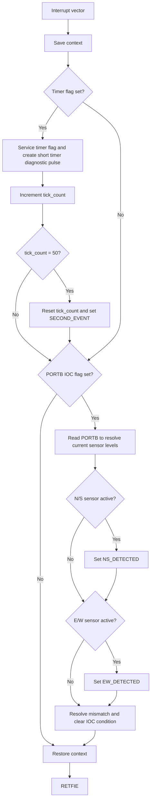
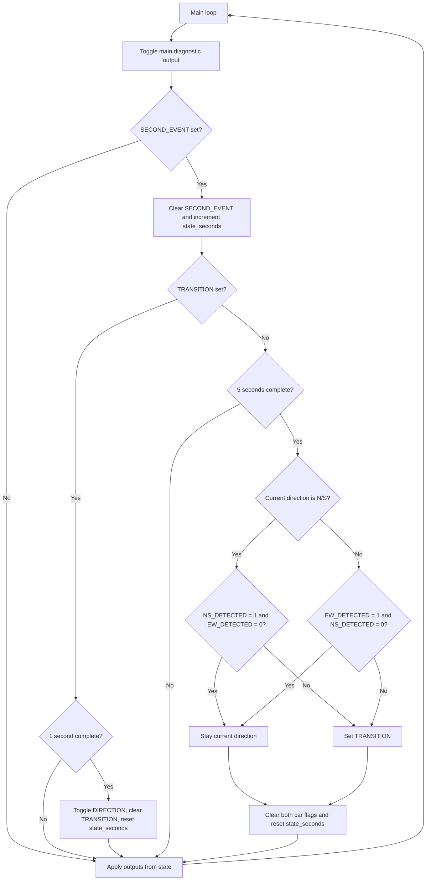

<a id="top"></a>

# RCET 3375 Lab 06 - Timers and Event-Driven State

[RCET3375 course home](../README.md)

PIC16F883 | pic-as | Hardware Timers | Interrupt Timing | State | PORTB IOC | Traffic Control

## Contents

- [Purpose](#purpose)
- [Standards and references](#standards-references)
- [Equipment and materials](#equipment-materials)
- [Lab-book documentation](#lab-book-documentation)
- [Part 1 - 20 ms timer proof of life](#part-1)
- [Part 2 - One-second timing and intersection state](#part-2)
- [Part 3 - Timed intersection state machine](#part-3)
- [Part 4 - Car-detection state machine](#part-4)
- [Part 5 - Mastery: train-crossing override](#part-5)
- [Submission and checkoff](#submission)

<a id="purpose"></a>
## Purpose

Use a PIC16F883 hardware timer to create a measured 20 ms periodic interrupt, observe exactly how interrupt service affects normal main-loop execution, and then use short interrupt service routines to update state while the main loop decides what the system should do.

This lab continues the interrupt work from Lab 05. The important change is that interrupts are no longer only external events. A hardware timer becomes a regular source of state updates.

The final required application is a two-direction traffic intersection. Timing, traffic direction, transition status, and car detections are represented explicitly in software state.

The architecture for the completed required lab is:

```text
hardware timer / PORTB IOC
        |
        v
short interrupt service
updates state and returns
        |
        v
main loop evaluates state
        |
        v
PORTC traffic-light outputs
```

Parts 1-4 use **pic-as assembly**. Long software delays are not used to create the intersection timing.

[Back to top](#top) · [Course home](../README.md)

<a id="standards-references"></a>
## Standards and references

- [RCET 3375 Lab Standard](../LAB_STANDARD.md)
- [RCET PIC-AS Style Guide](../Notes/RCET_PIC-AS_Style_Guide.md)
- [RCET 3373 PIC16F883 Timers](https://github.com/rosstimo/RCET3373/blob/main/Topics/timers.md)
- [RCET Flowchart Guide](https://github.com/rosstimo/RCET3371/blob/main/Guides/Flowcharts/RCET-Flowchart-Guide.md)
- [PIC16F882/883/884/886/887 Data Sheet](https://ww1.microchip.com/downloads/aemDocuments/documents/OTH/ProductDocuments/DataSheets/40001291H.pdf)
- [PICmicro Mid-Range MCU Family Reference Manual](https://ww1.microchip.com/downloads/en/DeviceDoc/33023A.pdf)
- previous RCET3375 lab-book documentation and source for interrupts, context saving, digital I/O, and measurement

The PIC16F883 data sheet is the authority for the timer you choose, its flag/enable path, PORTB interrupt-on-change behavior, register settings, reset states, and electrical limits.

For the course 4 MHz oscillator:

```text
FOSC = 4 MHz
FCY  = FOSC / 4 = 1 MHz
TCY  = 1 us
```

You may use **Timer0, Timer1, or Timer2** for the periodic 20 ms interrupt. Your timer choice, configuration, period boundary, and timing calculations must be fully documented.

Use the same timer through the required parts unless the instructor approves a change.

[Back to top](#top) · [Course home](../README.md)

<a id="equipment-materials"></a>
## Equipment and materials

- MPLAB X IDE and pic-as toolchain
- PICkit programmer/debugger
- PIC16F883 circuit
- 4 MHz crystal oscillator circuit
- six LEDs for the two traffic signals
- current-limiting resistors
- two digital car-detection inputs for Part 4
- one additional train-detection input for optional Mastery
- oscilloscope
- frequency counter or logic analyzer, optional
- a method for producing and verifying a 20 ms digital car-detection pulse
- breadboard, jumpers, and interface components as required
- lab book

Any external signal source connected to the PIC must use compatible logic levels and a common reference.

[Back to top](#top) · [Course home](../README.md)

<a id="lab-book-documentation"></a>
## Lab-book documentation

Follow the [RCET3375 Lab Standard](../LAB_STANDARD.md). Reference earlier complete documentation instead of copying unchanged material.

For this assignment also include:

- timer selection and justification;
- the complete timing chain from the 4 MHz oscillator to the 20 ms interrupt;
- complete documentation for each newly used timer/interrupt SFR and relevant bit;
- the exact definition of the beginning of a timer period for your chosen timer;
- instruction-cycle analysis between that timer-period boundary and the Part 1 diagnostic rising edge;
- the required `intersection_state` GPR register map;
- a complete PORTC traffic-light bit map and all four legal normal traffic-light output patterns;
- a complete PORTB car-detection input map and all four car-detection input combinations;
- state-machine flowcharts;
- predicted and measured timing;
- evidence that a car can be detected anywhere in the normal timing cycle even if its active pulse lasts only 20 ms;
- documentation of measurement difficulties and justified changes made to obtain a valid measurement;
- the GitHub URL for the assignment repository.

A car-detection flag means **a car was detected during the current decision window**. It is not a car counter. Detecting another car in the same direction before the flag is cleared does not increment anything; the flag simply remains set.

[Back to top](#top) · [Course home](../README.md)

<a id="part-1"></a>
## Part 1 - 20 ms Timer Proof of Life

### Goal

Configure one PIC16F883 hardware timer to generate a periodic interrupt every **20 ms nominal**.

Use two diagnostic PORTA outputs to measure both the timer interrupt and the effect of the interrupt on main-loop execution.

### Required diagnostic signals

Choose two available digital PORTA outputs and document them.

**Timer diagnostic pulse**

For every timer interrupt:

1. service the timer as required by your design;
2. drive the timer diagnostic output HIGH;
3. drive it LOW on the immediately following instruction.

The pulse should therefore be as short as practical. The two output instructions should be adjacent, equivalent to:

```text
set timer diagnostic bit
clear timer diagnostic bit
```

This produces one short diagnostic pulse every 20 ms.

**Main-loop diagnostic**

In main, continuously toggle the second PORTA diagnostic bit with no intentional delay.

The main-loop signal should make it easy to see where normal execution is interrupted and where it resumes.

### Timer-period boundary

Define exactly what marks the beginning of a new timer period for your chosen timer.

Examples include:

- hardware overflow;
- hardware compare/reset;
- a software reload that begins the next measured interval.

Your implementation determines which definition applies.

Place the rising edge of the timer diagnostic pulse as close as practical to that period boundary.

Then determine exactly how far the diagnostic rising edge leads or lags the timer-period boundary.

Express the offset in:

- instruction cycles;
- microseconds.

Do not assume the GPIO edge and the hardware timer event occur at the same instant.

### Required behavior

- 20 ms periodic timer interrupt.
- One very short PORTA diagnostic pulse per timer interrupt.
- A second PORTA diagnostic bit toggling continuously in main.
- Correct interrupt context save/restore.
- Correct timer flag service and reload/configuration behavior.
- No software-delay loop used to generate the 20 ms period.
- Main resumes normally after every timer interrupt.

### Before Lab

Prepare:

- timer choice and reason;
- complete timer calculation;
- timer and interrupt SFR documentation;
- timer-period boundary definition;
- predicted timer diagnostic pulse spacing;
- predicted instruction-cycle offset from the timer-period boundary to the diagnostic rising edge;
- selected PORTA diagnostic pins;
- main/ISR flowchart;
- source code.

### In the Lab

1. Verify the main-loop diagnostic signal before enabling the timer interrupt.
2. Enable the timer and verify one timer diagnostic pulse every 20 ms.
3. Display both PORTA diagnostic signals on the oscilloscope.
4. Observe where the timer interrupt disturbs the otherwise continuous main-loop diagnostic activity.
5. Measure the timer diagnostic pulse spacing.
6. Compare measured timing with the predicted 20 ms period.
7. Compare the observed diagnostic rising edge with your calculated timer-period boundary.
8. Explain the instruction path that creates the measured lead or lag.

The shortest diagnostic pulse may be difficult to trigger on or display cleanly. If measurement limitations require you to temporarily widen the pulse, change the test conditions, or use another instrument configuration, document:

- what was difficult to measure;
- what you changed;
- why the change was justified;
- whether the change affects the timing quantity being evaluated.

The final timing conclusion must still refer to the actual program behavior.

### Evidence

Include or reference:

- complete timer calculation;
- timer SFR documentation;
- main/ISR flowchart;
- final source;
- scope capture showing the short timer diagnostic pulse;
- scope capture showing the main-loop diagnostic interrupted by timer service;
- measured 20 ms period;
- predicted versus measured timing;
- instruction-cycle calculation for the diagnostic rising-edge lead/lag;
- measurement difficulties and any justified test modifications;
- troubleshooting record.

### Demonstrate

Show both diagnostic signals simultaneously.

Be prepared to trace execution from the timer event through interrupt entry, context save, timer service, diagnostic pulse, context restore, and return to main.

### Complete When

Part 1 is complete when the timer produces an accurately measured 20 ms periodic interrupt, both diagnostic signals clearly show timer and main execution, and you can account for the timer diagnostic rising-edge offset in instruction cycles and microseconds.

[Back to top](#top) · [Course home](../README.md)

<a id="part-2"></a>
## Part 2 - One-Second Timing and Intersection State

### Goal

Convert the 20 ms periodic timer event into a 1-second timing basis, create the traffic-light hardware on PORTC, and represent the intersection's operating state in one GPR.

### One-second timing basis

Use the 20 ms timer interrupt to count elapsed time.

```text
50 timer events x 20 ms = 1 second
```

The timer ISR should remain short. When 50 timer events have occurred, the ISR sets the `SECOND_EVENT` bit in `intersection_state` and returns.

Main detects `SECOND_EVENT`, performs the required one-second work, then clears the flag.

Use a separate GPR such as `tick_count` for the 0-49 timer-event count.

### Required state register

Use one GPR named `intersection_state` for the intersection flags.

Choose and document its GPR address.

Use this register map:

| Bit | 7 | 6 | 5 | 4 | 3 | 2 | 1 | 0 |
| --- | --- | --- | --- | --- | --- | --- | --- | --- |
| Name | Reserved | Reserved | `TRAIN_ACTIVE` | `SECOND_EVENT` | `TRANSITION` | `EW_DETECTED` | `NS_DETECTED` | `DIRECTION` |

### Bit definitions

| Bit | Meaning |
| --- | --- |
| `DIRECTION` | 0 = N/S is the active direction; 1 = E/W is the active direction |
| `NS_DETECTED` | a car has been detected in the N/S direction during the current decision window |
| `EW_DETECTED` | a car has been detected in the E/W direction during the current decision window |
| `TRANSITION` | 0 = active direction is green; 1 = active direction is in its 1-second yellow transition |
| `SECOND_EVENT` | set by timer service every 1 second; main clears it after processing |
| `TRAIN_ACTIVE` | reserved for optional Part 5 Mastery |

During normal Parts 2-4, keep `TRAIN_ACTIVE` clear.

When `TRANSITION = 1`, `DIRECTION` identifies the direction currently displaying yellow. At the end of the transition, main toggles `DIRECTION` and clears `TRANSITION`.

### PORTC traffic-light outputs

Use PORTC to drive all six traffic-light LEDs:

- N/S red;
- N/S yellow;
- N/S green;
- E/W red;
- E/W yellow;
- E/W green.

You choose and document the six PORTC bit assignments unless the instructor assigns them.

Your lab book must include a PORTC register map and the exact binary/hex value for each legal normal traffic-light state:

| `DIRECTION` | `TRANSITION` | N/S lights | E/W lights | PORTC value |
| ---: | ---: | --- | --- | --- |
| 0 | 0 | Green | Red | student documents |
| 0 | 1 | Yellow | Red | student documents |
| 1 | 0 | Red | Green | student documents |
| 1 | 1 | Red | Yellow | student documents |

No other normal traffic-light combination is allowed.

### Before Lab

Prepare:

- 1-second timing calculation;
- `tick_count` documentation;
- the complete `intersection_state` register map;
- six-LED PORTC schematic and loading analysis;
- PORTC bit assignments;
- completed four-state PORTC value table;
- source code for timer event accumulation and state-to-output decoding.

### In the Lab

1. Verify the 20 ms timer interrupt remains accurate.
2. Verify `SECOND_EVENT` occurs once per second.
3. Verify main observes and clears `SECOND_EVENT`.
4. Verify all four legal PORTC traffic-light states individually.
5. Confirm that changing `DIRECTION` and `TRANSITION` produces the expected light pattern.
6. Confirm no output decoding produces conflicting green indications.

### Evidence

Include or reference:

- timing calculation;
- `intersection_state` register map;
- PORTC map and four legal output values;
- final source;
- measured 1-second timing;
- evidence for all four legal traffic-light states;
- troubleshooting record.

### Demonstrate

Show the one-second event and all four legal traffic-light states.

Be prepared to explain why the state is stored separately from the physical output value on PORTC.

### Complete When

Part 2 is complete when the timer creates a reliable 1-second event, the state register follows the required map, and main can decode `DIRECTION` and `TRANSITION` into all four correct PORTC traffic-light states.

[Back to top](#top) · [Course home](../README.md)

<a id="part-3"></a>
## Part 3 - Timed Intersection State Machine

### Goal

Use the state representation from Part 2 to operate the intersection continuously without car detection.

The active direction remains green for 5 seconds. The yellow transition lasts 1 second.

### Required timing

Normal operation alternates:

```text
N/S green, E/W red       5 seconds
N/S yellow, E/W red      1 second
N/S red, E/W green       5 seconds
N/S red, E/W yellow      1 second
repeat
```

Use the 1-second event from Part 2 as the basis for all intersection timing.

Use a GPR such as `state_seconds` to track the number of one-second events elapsed in the current green or transition state.

### State-machine rules

When `TRANSITION = 0`:

- the direction selected by `DIRECTION` is green;
- count 5 one-second events;
- after the fifth second, set `TRANSITION`;
- reset `state_seconds`.

When `TRANSITION = 1`:

- the direction selected by `DIRECTION` is yellow;
- the opposite direction remains red;
- count 1 one-second event;
- after that second:
  - toggle `DIRECTION`;
  - clear `TRANSITION`;
  - reset `state_seconds`.

The timer ISR updates timing state and returns. Main evaluates the state and applies the appropriate traffic-light output.

Do not wait inside the ISR for 1 or 5 seconds.

### Before Lab

Prepare:

- complete state-machine flowchart;
- `state_seconds` documentation;
- source code;
- predicted sequence and timing;
- any updates to the PORTC state table.

### In the Lab

1. Start with N/S green.
2. Verify a 5-second N/S green interval.
3. Verify the 1-second N/S yellow transition.
4. Verify a 5-second E/W green interval.
5. Verify the 1-second E/W yellow transition.
6. Observe several complete cycles.
7. Measure at least one 5-second interval and one 1-second interval.
8. Verify that no state change creates conflicting green outputs.

### Evidence

Include or reference:

- state-machine flowchart;
- state/state-timing GPR documentation;
- final source;
- measured 5-second green interval;
- measured 1-second yellow interval;
- observed complete sequence;
- troubleshooting record.

### Demonstrate

Show continuous normal intersection timing with no car-detection inputs.

Be prepared to explain what every used bit in `intersection_state` means and how main decides what PORTC should display.

### Complete When

Part 3 is complete when the intersection alternates indefinitely with accurate 5-second green and 1-second yellow timing and no invalid traffic-light state.

[Back to top](#top) · [Course home](../README.md)

<a id="part-4"></a>
## Part 4 - Car-Detection State Machine

### Goal

Add two PORTB interrupt-on-change car-detection sensors to the Part 3 intersection.

A car can be detected at any time. It may be passing through the sensor rather than waiting at the intersection.

The system records whether at least one car was detected in each direction during the current decision window. It does **not** count cars.

### PORTB car-detection inputs

Use PORTB interrupt-on-change for both required car-detection sensors.

Document the exact PORTB bits and active logic level used for:

- N/S car detection;
- E/W car detection.

Your lab book must include a PORTB register map and all four instantaneous sensor combinations:

| N/S sensor | E/W sensor | Meaning | PORTB value |
| ---: | ---: | --- | --- |
| 0 | 0 | neither sensor active | student documents |
| 0 | 1 | E/W sensor active | student documents |
| 1 | 0 | N/S sensor active | student documents |
| 1 | 1 | both sensors active | student documents |

The table above shows logical sensor state. Your actual PORTB bit pattern depends on the pins and active level you select.

### Detection-latch behavior

The IOC service must read PORTB as required to resolve the mismatch/change condition.

When an active car-detection level is observed:

- N/S detection sets `NS_DETECTED`;
- E/W detection sets `EW_DETECTED`.

An inactive edge must **not** clear a latched car-detection flag.

The flag remains set until the end-of-green evaluation in main.

Therefore:

- a short pulse can end long before the 5-second interval ends and still be remembered;
- repeated detections in the same direction do not count additional cars;
- the flag simply remains set.

### Required 20 ms detection capability

A car-detection pulse may occur anywhere during normal operation and may be active for only **20 ms**.

You must provide sufficient measurement evidence that there is no point in the normal timing cycle where such a pulse can occur without being detected.

The 20 ms requirement is a detection requirement, not a polling interval.

### End-of-green decision logic

At the end of each 5-second green interval, main evaluates the two latched car-detection flags.

The rule is:

> Stay in the current direction only when the current direction is the **only** direction in which a car was detected. Otherwise, transition to the opposite direction.

For N/S green:

| N/S detected | E/W detected | Action |
| ---: | ---: | --- |
| 1 | 0 | remain N/S for a fresh 5 seconds |
| 0 | 1 | transition to E/W |
| 1 | 1 | transition to E/W |
| 0 | 0 | transition to E/W |

For E/W green:

| N/S detected | E/W detected | Action |
| ---: | ---: | --- |
| 0 | 1 | remain E/W for a fresh 5 seconds |
| 1 | 0 | transition to N/S |
| 1 | 1 | transition to N/S |
| 0 | 0 | transition to N/S |

After the end-of-green evaluation, clear both `NS_DETECTED` and `EW_DETECTED`.

Any new detection after that clear, including a detection during the 1-second yellow transition, belongs to the next decision window and must remain latched until the next end-of-green evaluation.

### Part 4 pseudocode

The following pseudocode defines the required control behavior. Translate the behavior into pic-as rather than copying the pseudocode as source.

```text
SETUP:
    configure timer for 20 ms interrupt
    configure PORTB IOC car sensors
    configure PORTC traffic outputs
    configure PORTA diagnostic outputs
    clear tick_count
    clear state_seconds
    clear intersection_state
    DIRECTION = N/S
    TRANSITION = 0
    apply traffic outputs from intersection_state
    enable interrupts

COMMON ISR:
    save context

    if timer interrupt flag is set:
        service/clear timer flag as required
        create short timer diagnostic pulse
        tick_count = tick_count + 1

        if tick_count == 50:
            tick_count = 0
            set SECOND_EVENT

    if PORTB IOC flag is set:
        sensor_sample = read PORTB

        if N/S car sensor is active:
            set NS_DETECTED

        if E/W car sensor is active:
            set EW_DETECTED

        resolve/clear IOC condition correctly

    restore context
    return from interrupt

MAIN LOOP:
    toggle main diagnostic output

    if SECOND_EVENT is clear:
        apply traffic outputs from intersection_state
        repeat MAIN LOOP

    clear SECOND_EVENT
    state_seconds = state_seconds + 1

    if TRANSITION == 1:
        if state_seconds < 1:
            apply traffic outputs
            repeat MAIN LOOP

        toggle DIRECTION
        clear TRANSITION
        state_seconds = 0
        apply traffic outputs
        repeat MAIN LOOP

    ; TRANSITION == 0, so current direction is green

    if state_seconds < 5:
        apply traffic outputs
        repeat MAIN LOOP

    ; 5-second green interval has ended

    if DIRECTION == N/S:
        if NS_DETECTED == 1 AND EW_DETECTED == 0:
            stay_current_direction = true
        else:
            stay_current_direction = false

    if DIRECTION == E/W:
        if EW_DETECTED == 1 AND NS_DETECTED == 0:
            stay_current_direction = true
        else:
            stay_current_direction = false

    clear NS_DETECTED
    clear EW_DETECTED
    state_seconds = 0

    if stay_current_direction == true:
        clear TRANSITION
    else:
        set TRANSITION

    apply traffic outputs
    repeat MAIN LOOP
```

### Part 4 flowchart - interrupt service



### Part 4 flowchart - main state machine



### Before Lab

Prepare:

- PORTB IOC schematic;
- loading/electrical analysis;
- PORTB sensor register map;
- all four sensor combinations;
- IOC SFR documentation;
- completed Part 4 pseudocode review in your lab book;
- Part 4 flowcharts;
- source code;
- a test method for a measured 20 ms sensor pulse;
- expected results for every end-of-green decision case.

### In the Lab

1. Verify N/S sensor IOC independently.
2. Verify E/W sensor IOC independently.
3. Confirm a detection flag remains set after the physical sensor pulse ends.
4. Confirm repeated detections in the same direction do not count additional cars.
5. Demonstrate N/S-only detection while N/S is green and verify the intersection remains N/S for a fresh 5 seconds.
6. Demonstrate E/W-only detection while N/S is green and verify a transition occurs.
7. Demonstrate both detections while N/S is green and verify a transition occurs.
8. Demonstrate no detections while N/S is green and verify a transition occurs.
9. Repeat the equivalent cases with E/W green.
10. Apply a measured 20 ms car-detection pulse at several points within a 5-second interval.
11. Apply a 20 ms pulse during the yellow transition and verify it is retained for the next decision window.
12. Stress the system with timer and IOC events occurring close together.
13. Verify no test creates conflicting green indications.

### Evidence

Include or reference:

- PORTB sensor schematic and register map;
- all four PORTB sensor states;
- IOC and timer SFR documentation;
- final source;
- final state-machine flowcharts;
- evidence for all end-of-green decision cases;
- oscilloscope evidence of the 20 ms detection pulse;
- evidence that 20 ms detections are retained even when the physical input is no longer active;
- evidence for detection during the yellow transition;
- measured 5-second and 1-second intersection timing;
- troubleshooting record.

### Demonstrate

The instructor may create car detections in either direction at arbitrary times.

Be prepared to explain:

- why IOC is used instead of relying on polling;
- why an inactive sensor edge does not clear a latched detection;
- when both detection flags are cleared;
- why repeated detections are not car counts;
- why the system remains in the current direction only when that direction is the only one detected;
- how detections during the transition become part of the next decision window;
- why the ISR updates state quickly and leaves decisions to main.

### Complete When

Part 4 is complete when the intersection responds correctly to every required detection combination, captures a 20 ms detection anywhere in normal operation, preserves safe traffic-light states, and the demonstrated behavior matches the provided pseudocode and flowcharts.

[Back to top](#top) · [Course home](../README.md)

<a id="part-5"></a>
## Part 5 - Mastery: Train-Crossing Override

**Optional. Complete Parts 1-4 first.**

**Bonus:** Completing this Mastery challenge earns **+5 percentage points on this lab assignment**, equivalent to offsetting one day of the course's 5%-per-day late penalty.

### Goal

Add a train-detection input that temporarily overrides normal intersection operation.

While a train is detected, both traffic directions continuously flash between yellow and red every 0.5 seconds.

When the train is no longer detected, normal intersection operation resumes with the direction that was active before the train event.

### Required behavior

Use another PORTB interrupt-on-change sensor for train detection.

`TRAIN_ACTIVE` in `intersection_state` represents the current train-sensor condition.

Unlike the car-detection bits, `TRAIN_ACTIVE` is not a latched "was detected" event. It represents whether the train input is currently active.

When a train becomes active:

- set `TRAIN_ACTIVE` quickly in interrupt service;
- preserve `DIRECTION`;
- normal car-based intersection decisions are suspended;
- both directions immediately leave normal green/yellow operation;
- both directions display yellow for 0.5 seconds;
- both directions display red for 0.5 seconds;
- continue alternating yellow/red every 0.5 seconds for as long as the train remains detected.

Use the existing 20 ms timer:

```text
25 timer events x 20 ms = 0.5 second
```

The train flashing must not use a blocking delay.

When the train is no longer detected:

- clear `TRAIN_ACTIVE`;
- stop the train flashing sequence;
- keep the same `DIRECTION` value that was active before the train override;
- clear `TRANSITION`;
- clear `NS_DETECTED` and `EW_DETECTED`;
- reset intersection timing;
- resume the preserved direction as green for a **fresh 5-second interval**;
- begin with a **fresh car-detection state**.

If the train is detected while a yellow transition is in progress, the stored `DIRECTION` value still identifies the direction that was active before the transition completed. That direction is the one resumed after the train clears.

Car detections that occur during the train override do not need to be retained because normal operation explicitly resumes with fresh car-detection state.

### Before Lab

Prepare:

- train sensor schematic and PORTB assignment;
- updated `intersection_state` register documentation;
- train-override state flowchart;
- 0.5-second timing calculation;
- source code;
- expected behavior for train detection during:
  - N/S green;
  - E/W green;
  - N/S yellow;
  - E/W yellow.

### In the Lab

1. Verify the train sensor IOC.
2. Trigger the train during N/S green.
3. Verify immediate entry into the yellow/red flashing override.
4. Measure the 0.5-second flash timing.
5. Keep the train input active through several yellow/red cycles.
6. Clear the train input.
7. Verify N/S resumes green for a fresh 5 seconds with both car-detection flags cleared.
8. Repeat from E/W green.
9. Trigger the train during a yellow transition and verify the previously active direction is restored for a fresh 5 seconds.
10. Verify normal car-detection logic operates correctly after the train override ends.

### Evidence

Include or reference:

- train sensor schematic and PORTB map;
- updated state register map;
- train-override flowchart;
- final source;
- measured 0.5-second flashing interval;
- train-active yellow/red sequence;
- evidence that flashing continues as long as the train input remains active;
- evidence that the preserved direction resumes for a fresh 5 seconds;
- evidence that car-detection state is fresh after recovery;
- troubleshooting record.

### Demonstrate

The instructor may activate and clear the train input at arbitrary points in normal operation.

Be prepared to explain why `DIRECTION` is preserved, why car-detection state is discarded, and how the same 20 ms timer supports 0.5-second train flashing, 1-second transitions, and 5-second green timing without blocking delays.

### Complete When

Mastery is complete when train detection overrides normal operation immediately, both directions alternate between yellow and red every 0.5 seconds while the train remains detected, and clearing the train returns the preserved direction to a fresh 5-second green interval with fresh car-detection state.

[Back to top](#top) · [Course home](../README.md)

<a id="submission"></a>
## Submission and Checkoff

Use one Git repository for this assignment, following the [RCET3375 Lab Standard](../LAB_STANDARD.md).

Your final repository must contain enough information to reopen, rebuild, inspect, and verify the assignment, including:

- complete MPLAB project source;
- schematic source/export as applicable;
- required measurement evidence;
- readable lab-book PDF;
- final flowcharts;
- completed register maps and state tables;
- documentation needed to understand the final design.

Push the repository to GitHub before final checkoff.

A part is not complete until the required behavior works, the evidence is present, and you can explain the state, timing, interrupt, and measurement behavior.

[Back to top](#top) · [Course home](../README.md)
