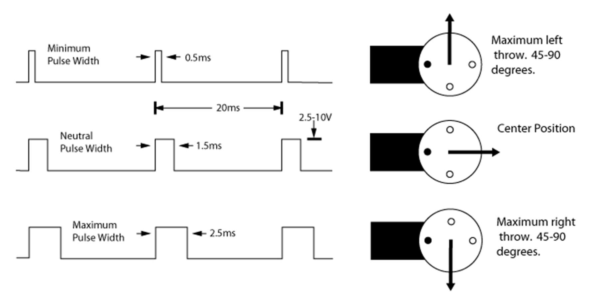

<a id="top"></a>

# RCET 3375 Lab 07 - ADC and Servo Control

[RCET3375 course home](../README.md)

PIC16F883 | pic-as | ADC | CCP Compare | Servo Control | Measurement

## Contents

- [Purpose](#purpose)
- [Standards and references](#standards-references)
- [Equipment and materials](#equipment-materials)
- [Visual and code references](#visual-code)
- [Part 1 - ADC proof of life](#part-1)
- [Part 2 - ADC-to-servo mapping](#part-2)
- [Part 3 - 6-bit lookup table and CCP Compare](#part-3)
- [Part 4 - Full 10-bit calculated mapping](#part-4)
- [Part 5 - Mastery: three-servo CCP scheduler](#part-5)
- [Submission and checkoff](#submission)[text](Lab07-ADC.md)

<a id="purpose"></a>
## Purpose

Measure PIC16F883 ADC behavior, then use the ADC result to control servo pulse width.

The lab progresses from ADC bring-up to a 21-position servo, then to CCP-based timing with 6-bit and full 10-bit command resolution.

[Back to top](#top)

<a id="standards-references"></a>
## Standards and references

- [RCET 3375 Lab Standard](../LAB_STANDARD.md)
- [RCET PIC-AS Style Guide](../Notes/RCET_PIC-AS_Style_Guide.md)
- [Starting a PIC-AS Project](../HowTo/PIC-AS-Project-Setup.md)
- [RCET 3373 PIC16F883 ADC and Sensor Conditioning](https://github.com/rosstimo/RCET3373/blob/main/Topics/pic16f883-adc.md)
- [RCET 3373 Lookup Tables and Dynamic Timing](https://github.com/rosstimo/RCET3373/blob/main/Topics/lookup-tables-dynamic-timing.md)
- [PIC16F882/883/884/886/887 Data Sheet](https://ww1.microchip.com/downloads/aemDocuments/documents/OTH/ProductDocuments/DataSheets/40001291H.pdf)
- [PIC16F88X Family Silicon Errata and Data Sheet Clarifications](https://ww1.microchip.com/downloads/aemDocuments/documents/MCU08/ProductDocuments/Errata/PIC16F88X-Family-Si-Errata-Data-Sheet-Clarifications-DS80000302.pdf)

Use the PIC16F883 data sheet as the device authority. Use the current errata correction for the ADC acquisition-time calculation.

[Back to top](#top)

<a id="equipment-materials"></a>
## Equipment and materials

- PIC16F883 circuit with 4 MHz crystal
- MPLAB X, pic-as, and PICkit 3
- potentiometer
- LEDs and current-limiting resistors for PORTB and PORTC
- digital multimeter and oscilloscope
- one servo for Parts 2 through 4
- three servos and three potentiometers for optional Mastery
- suitable servo power supply, breadboard, and jumpers
- lab book

[Back to top](#top)


<a id="part-1"></a>
## Part 1 - ADC Proof of Life

### Goal

Continuously convert a potentiometer voltage and make the complete 10-bit result observable.

Use one analog input with VDD and VSS as the ADC references. Copy `ADRESH` to PORTC and `ADRESL` to PORTB after each conversion. Use one digital output to mark the conversion interval.

### Quick calculation references

Use the [RCET 3373 ADC guide](https://github.com/rosstimo/RCET3373/blob/main/Topics/pic16f883-adc.md) for the ADC model and the device data sheet for register details.

#### Worked example: ADC clock and conversion time

**What:** find $T_{AD}$ and the ideal hardware conversion time.

**Why:** the ADC clock must meet the device timing requirement before measured conversion time is meaningful.

For $F_{OSC}=4\,\text{MHz}$ and ADC clock $F_{OSC}/8$:

```math
\begin{aligned}
T_{AD} &= \frac{8}{4\,\text{MHz}} \\
&= 2\,\mu\text{s}
\end{aligned}
```

A 10-bit conversion uses 11 $T_{AD}$ periods:

```math
\begin{aligned}
t_{\text{conversion}} &= 11T_{AD} \\
&= 11(2\,\mu\text{s}) \\
&= 22\,\mu\text{s}
\end{aligned}
```

Use your selected ADC clock and actual oscillator when documenting your design.

#### Worked example: potentiometer source resistance and acquisition time

**What:** find the source resistance seen by the ADC, then use it in the corrected acquisition-time equation.

**Why:** the ADC holding capacitor charges through the source and internal resistances.

For a $10\,\text{k}\Omega$ potentiometer at midpoint:

```math
\begin{aligned}
R_S &= 5\,\text{k}\Omega \parallel 5\,\text{k}\Omega \\
&= \frac{(5\,\text{k}\Omega)(5\,\text{k}\Omega)}
        {5\,\text{k}\Omega+5\,\text{k}\Omega} \\
&= 2.5\,\text{k}\Omega
\end{aligned}
```

Using the corrected errata example values at $25^\circ\text{C}$:

```math
\begin{aligned}
T_C &=
-C_{HOLD}(R_{IC}+R_{SS}+R_S)
\ln\left(\frac{1}{2047}\right) \\
&=
-(10\,\text{pF})(1\,\text{k}\Omega+7\,\text{k}\Omega+2.5\,\text{k}\Omega)
\ln\left(\frac{1}{2047}\right) \\
&\approx 0.80\,\mu\text{s}
\end{aligned}
```

At $25^\circ\text{C}$, the temperature term is zero:

```math
\begin{aligned}
T_{ACQ} &= T_{AMP}+T_C+T_{COFF} \\
&= 2\,\mu\text{s}+0.80\,\mu\text{s}+0 \\
&= 2.80\,\mu\text{s}
\end{aligned}
```

Use the actual potentiometer value, wiper position, and design assumptions for your calculation.

#### Worked example: volts per count

**What:** convert the measured reference range into ADC resolution.

**Why:** this gives the expected voltage represented by one ADC count.

For measured $V_{DD}=4.96\,\text{V}$ and $V_{SS}=0\,\text{V}$:

```math
\begin{aligned}
\Delta V &= \frac{4.96\,\text{V}}{1024} \\
&= 4.84\,\text{mV/count}
\end{aligned}
```

For ADC code 512:

```math
\begin{aligned}
V_{IN} &\approx 512(4.84\,\text{mV}) \\
&\approx 2.48\,\text{V}
\end{aligned}
```

Use your measured reference voltage in the lab.

### Before Lab

Prepare or reference:

- ADC/potentiometer schematic and electrical-loading analysis;
- ADC SFR documentation for `ANSEL/ANSELH`, `ADCON0`, `ADCON1`, `ADRESH`, and `ADRESL`;
- selected channel, references, ADC clock, $T_{AD}$, conversion time, source resistance, and acquisition time;
- main-loop flowchart and source code.

### In the Lab

1. Measure VDD and verify the potentiometer spans approximately 0 V to VDD.
2. Run continuous conversions with the calculated acquisition delay.
3. Mark each conversion by driving the diagnostic output HIGH immediately before setting `GO/DONE` and LOW after completion.
4. Measure the diagnostic pulse and compare it with the predicted conversion time. Account for instruction and polling overhead.
5. Demonstrate both right- and left-justified results on PORTB/PORTC.
6. Record DMM voltage and 10-bit ADC code near 0%, 25%, 50%, 75%, and 100% of the range.
7. Calculate voltage from each ADC code and compare it with the DMM measurement.

### Evidence

Include or reference:

- schematic, loading analysis, SFR documentation, flowchart, and final source;
- ADC clock, conversion-time, source-resistance, acquisition-time, and volts-per-count calculations;
- conversion diagnostic scope capture with predicted versus measured timing;
- result placement for both justification modes;
- measured-voltage comparison table.

| Measured $V_{IN}$ | ADC code | Voltage from ADC | Difference |
| ---: | ---: | ---: | ---: |
|  |  |  |  |

### Demonstrate

Show continuous conversion, both justification modes, the diagnostic waveform, and agreement between ADC-derived voltage and the DMM.

Explain acquisition versus conversion, your $T_{AD}$ choice, source resistance, result justification, and the measured timing difference.

### Complete When

Part 1 is complete when the full 10-bit result is observable, acquisition and conversion timing are calculated and measured, both result formats are demonstrated, and the ADC result agrees reasonably with independent voltage measurement.

[Back to top](#top)

<a id="part-2"></a>
## Part 2 - ADC-to-Servo Mapping

### Goal

Use the ADC result to command one servo through 21 discrete pulse widths from $500\,\mu\text{s}$ to $2.5\,\text{ms}$ in $100\,\mu\text{s}$ steps. Maintain a nominal $20\,\text{ms}$ frame.



Verify the actual servo supply, control-input, current, and mechanical limits before connecting it.

### Quick calculation reference

**What:** determine the number of commanded positions.

**Why:** both endpoints count as positions.

```math
\begin{aligned}
\text{span} &= 2.5\,\text{ms}-0.5\,\text{ms} \\
&= 2.0\,\text{ms} \\
\text{intervals} &= \frac{2.0\,\text{ms}}{0.1\,\text{ms}} \\
&= 20 \\
\text{positions} &= 20+1 \\
&= 21
\end{aligned}
```

For position index $n$, where $0\le n\le20$:

```math
t_{\text{pulse}} = 500\,\mu\text{s}+n(100\,\mu\text{s})
```

Example for the center command:

```math
\begin{aligned}
t_{\text{pulse}} &= 500\,\mu\text{s}+10(100\,\mu\text{s}) \\
&= 1500\,\mu\text{s}
\end{aligned}
```

Develop a monotonic mapping from the 10-bit ADC range to indexes 0 through 20. All 21 indexes must be reachable.

### Before Lab

Prepare or reference:

- servo wiring and loading analysis;
- ADC-code ranges for all 21 position indexes;
- expected pulse width for each index;
- one hardware timer configured for a nominal $20\,\text{ms}$ frame;
- method for generating the variable HIGH time;
- timing calculations, flowchart, and source code.

### In the Lab

Keep the servo disconnected until instructor waveform checkoff.

1. Verify the $20\,\text{ms}$ frame.
2. Select each of the 21 indexes with the potentiometer and measure its HIGH pulse width.
3. Compare each measurement with the expected $500\,\mu\text{s}$ through $2.5\,\text{ms}$ sequence.
4. After checkoff, connect the servo with a suitable supply and common ground.
5. Sweep all 21 commands and record the observed mechanical position. Do not force the servo against a stop.

### Evidence

Use one table for the complete 21-position verification.

| Index | ADC range/code | Expected pulse | Measured pulse | Observed servo position |
| ---: | --- | ---: | ---: | ---: |
| 0 |  | $500\,\mu\text{s}$ |  |  |
| ... | ... | ... | ... | ... |
| 20 |  | $2.5\,\text{ms}$ |  |  |

Also include or reference the timer calculation, flowchart, final source, servo electrical analysis, and representative scope captures.

### Demonstrate

Before connecting the servo, show a stable $20\,\text{ms}$ frame and correct minimum, center, and maximum pulse widths.

After checkoff, demonstrate all 21 commanded positions and explain your ADC-to-index mapping and pulse-width generation method.

### Complete When

Part 2 is complete when all 21 commands are reachable, measured pulse widths match the required sequence, the frame remains stable, and the servo operates safely across its verified range.

[Back to top](#top)

<a id="part-3"></a>
## Part 3 - 6-Bit Lookup Table and CCP Compare

### Goal

Increase command resolution to 64 values. Use the upper 6 ADC bits as an index, Timer1 as a $1\,\mu\text{s}$ timebase and the $20\,\text{ms}$ frame, and CCP1 Compare to schedule the servo falling edge.

For this part, Timer1 reloads to `0xB1E0` for the required $20\,\text{ms}$ timing at each frame start. The supplied lookup module is built for that reload and $1\,\mu\text{s}$ timer tick.

### CCP Compare quick reference

Timer1 provides the running 16-bit timebase. `CCPR1H:CCPR1L` stores a 16-bit compare value. When Timer1 matches that value, CCP1 sets `CCP1IF`.

Use the compare interrupt to drive the servo output LOW so the CPU does not need to wait in a software delay for the falling edge and there will be only one interrupt at the end of the pulse.

Document `T1CON`, `TMR1H:TMR1L`, `CCP1CON`, `CCPR1H:CCPR1L`, `PIR1.CCP1IF`, `PIE1.CCP1IE`, and any other required SFRs from the PIC16F883 data sheet.

### 6-bit ADC result to 16-bit CCP1 compare value mapping

There are 64 commands and 63 intervals:
```math
\begin{aligned}
\Delta t &= \frac{2500\,\mu\text{s}-500\,\mu\text{s}}{63} \\
&= 31.746\ldots\,\mu\text{s}
\end{aligned}
```
#### Worked example

**What:** reduce the ADC result to 6 bits and convert that index into an absolute Timer1 compare value.

**Why:** the lookup table stores the deadline at which CCP will end the pulse.

For ADC result 512, a **left-justified** result places ADC bits 9:2 in `ADRESH`. Using only the high byte reduces the 10-bit result to its upper 8 bits. Reduce it to 6 bits by right-shifting the stored `ADRESH` value:

```text
ADC = 512
ADRESH:ADRESL     -> 10-bit: 1000000000
adc_h             -> 8-bit:  10000000
adc_h >> 2        -> 6-bit:  00100000 
adc_h = 32
```
Only two right shifts are required because `ADRESH` already contains the upper eight ADC bits. The resulting six-bit index is ADC bits 9:4.


For index 32:

```math
\begin{aligned}
t_{32} &=
500\,\mu\text{s}
+\mathrm{round}\left(\frac{32(2000\,\mu\text{s})}{63}\right) \\
&= 500\,\mu\text{s}+1016\,\mu\text{s} \\
&= 1516\,\mu\text{s}
\end{aligned}
```

Timer1 starts at `0xB1E0 = 45536` and ticks every $1\,\mu\text{s}$:

```math
\begin{aligned}
\text{CCP match} &= 45536+1516 \\
&= 47052 \\
\end{aligned}
```
The lookup table stores the absolute compare value for each index. The supplied module returns the 16-bit value in `ccp_next_h:ccp_next_l = 0xB7CC`, providing the falling-edge timing for the next frame.

### Supplied lookup module

Add [`Lab07-Part3-Lookup.S`](support/Lab07/Lab07-Part3-Lookup.S) to MPLAB X as a **separate source file**. Do not `#include` it. See [Starting a PIC-AS Project](../HowTo/PIC-AS-Project-Setup.md#4-organize-larger-projects-with-include-files-and-source-modules) for the module/linker explanation.

In `main.S`:

```assembly
ccp_next_l      EQU 0x23
ccp_next_h      EQU 0x24

GLOBAL  ccp_next_l, ccp_next_h
EXTRN   LookupAdc6ToCcp
```

Call the supplied routine with the 6-bit index in W:

```assembly
    PAGESEL LookupAdc6ToCcp
    call    LookupAdc6ToCcp
    PAGESEL $
```

The routine returns the absolute compare value in `ccp_next_h:ccp_next_l`. **It reserves Bank 0 address `0x25`.**
> **Note:** `PAGESEL` is required because the called routine may be linked on a different program-memory page than the main program.

### Required RAM

```text
pulse-busy flag
ADC conversion done flag
6-bit ADC index
saved 16-bit CCP match for next frame
ISR context storage for W and STATUS
Bank 0 address 0x25 reserved by supplied lookup module
```
### Required setup

```text
I/O:
    RA0/AN0 = potentiometer input
    RC2 = servo output, software controlled, start LOW

ADC:
    channel = AN0
    references = VDD and VSS
    clock = FOSC/8
    result = left justified
    ADC stays enabled between conversions

Timer1:
    clock = FOSC/4
    prescaler = 1:1
    tick = 1 us
    reload = 0xB1E0
    overflow = 20 ms frame

CCP1:
    mode = Compare, generate software interrupt on match; CCP1 pin unaffected
    timebase = Timer1

interrupts:
    clear Timer1 and CCP1 flags before starting
    enable Timer1 and CCP1 interrupts
    enable peripheral interrupts

startup:
    clear busy flag
    read ADC once
    set ADC conversion done flag
    calculate and load first CCP match
    start Timer1
    enable global interrupts
```
### Program structure

```text
main:
    only when pulse is not busy and ADC conversion not already done for the next frame
        acquire ADC once
        reduce to 6 bits and store
        call lookup routine for next frame
        set ADC conversion done flag
    Do other work that can be interrupted without issue

Timer1 overflow:
    start new 20ms frame
    reload Timer1 to 0xB1E0
    servo HIGH
    load saved CCP match
    clear ADC conversion done flag
    mark pulse busy

CCP1 compare:
    servo LOW
    clear pulse busy
```

Prepare **one** command per frame after the active pulse ends. **Do not** repeatedly acquire/map during the remaining idle time. **Do not** change the compare value during an active pulse.

### Before Lab

Prepare or reference:

- Timer1 $1\,\mu\text{s}$ tick and `0xB1E0` reload calculation. Verify the $20\,\text{ms}$ frame time;
- CCP1 SFR documentation;
- left-justified `ADRESH` to 6-bit index reduction and one worked lookup calculation;
- supplied lookup module added to the project;
- main/ISR flowcharts and source code.

### In the Lab

1. Verify Timer1 frame timing and CCP interrupt operation with the servo disconnected.
2. Verify first, center, and last table entries, then several intermediate values.
3. Confirm adjacent table entries differ by $31$ or $32\,\mu\text{s}$, averaging approximately $31.75\,\mu\text{s}$ across the full range.
4. Obtain instructor waveform checkoff.
5. Connect the servo and sweep the 64 commands.
6. Observe the mechanical response and compare it with Part 2 resolution. Is the servo resolution noticeable? Is the servo movement smooth?

### Evidence

Include or reference Timer1/CCP calculations and SFRs, flowcharts, final source, the supplied module, representative scope captures, measured endpoint/center/intermediate pulse widths, and comparison with Part 2 resolution.

### Demonstrate

Show CCP-controlled pulse timing and explain the 6-bit index, lookup deadline, Timer1 role, and CCP Compare role. Sweep the full range of the servo and explain the mechanical response compared with Part 2.

### Complete When

Part 3 is complete when all 64 commands are reachable, CCP schedules the falling edge, the pulse range is approximately $500\,\mu\text{s}$ to $2.5\,\text{ms}$, and both the PW and $20\,\text{ms}$ frame remain stable. There should be no apparent servo chatter or jitter.

[Back to top](#top)

<a id="part-4"></a>
## Part 4 - Full 10-Bit Calculated Mapping

### Goal

Using lookup tables to increase servo PW resolution quickly becomes impractical. Use all 10 ADC bits without two 1024-entry lookup tables by replacing the 6-bit lookup mapping with a full 10-bit mapping calculation. Keep the Timer1/CCP frame and pulse architecture from Part 3, use a right-justified 10-bit ADC result.

### 10-bit ADC result to 16-bit CCP1 compare value mapping

The ideal linear mapping is:

```math
t_{\text{pulse}} =
500\,\mu\text{s}
+\frac{\text{ADC}(2000\,\mu\text{s})}{1023}
```

The supplied mapping routine uses this PIC-friendly integer approximation:

```math
t_{\text{pulse}}[\mu\text{s}]
=
500
+2(\text{ADC})
-\left\lfloor\frac{3(\text{ADC})}{64}\right\rfloor
```

Endpoint check:

```math
\begin{aligned}
\text{ADC}=0 &: \quad t_{\text{pulse}}=500\,\mu\text{s} \\
\text{ADC}=1023 &: \quad t_{\text{pulse}}=2499\,\mu\text{s}
\end{aligned}
```

#### Worked example

**What:** map one full 10-bit ADC result into the next CCP deadline.

**Why:** the calculation replaces the large lookup table while preserving approximately $2\,\mu\text{s}$ command steps.

For ADC result 512:

```math
\begin{aligned}
t_{\text{pulse}}
&=500+2(512)-\left\lfloor\frac{3(512)}{64}\right\rfloor \\
&=500+1024-24 \\
&=1500\,\mu\text{s}
\end{aligned}
```

With Timer1 starting at `0xB1E0 = 45536`:

```math
\begin{aligned}
\text{CCP match} &= 45536+1500 \\
&=47036 \\
\end{aligned}
```
The supplied mapping module uses the stored 10-bit ADC result in `adc_h:adc_l = 0x0200` and returns the 16-bit absolute compare value in `ccp_next_h:ccp_next_l = 0xB7BC` providing the falling edge timing for the next frame.

### Supplied mapping module
Part 4 is essentially the same as Part 3 except the mapping is calculated instead of looked up. Add the mapping file [`Lab07-Part4-Map.S`](support/Lab07/Lab07-Part4-Map.S) to your MPLAB X project as a **separate source file**. Do not `#include` it. See [Starting a PIC-AS Project](../HowTo/PIC-AS-Project-Setup.md#4-organize-larger-projects-with-include-files-and-source-modules) for the module/linker explanation.

In `main.S`:

```assembly
ccp_next_l      EQU 0x21
ccp_next_h      EQU 0x22
adc_l           EQU 0x23
adc_h           EQU 0x24

GLOBAL  ccp_next_l, ccp_next_h, adc_l, adc_h
EXTRN   MapAdcToCcp
```

After `ReadAdc` stores the right-justified result in `adc_h:adc_l`:

```assembly
    PAGESEL MapAdcToCcp
    call    MapAdcToCcp
    PAGESEL $
```

The routine writes the next absolute CCP match to `ccp_next_h:ccp_next_l`, uses `adc_h:adc_l` as working registers, and **reserves Bank 0 address `0x25`**.
### Required RAM

Same as Part 3 but with a stored 2-byte ADC result instead of a 6-bit index.

### Required setup
Same as Part 3 but with a right-justified ADC result instead of left-justified.

### Program structure
Keep the same one-update-per-frame sequence from Part 3.

### Before Lab

Prepare or reference:

- Part 3 Timer1/CCP design;
- right-justified 10-bit ADC result, integer mapping, endpoint checks, and one worked example;
- supplied mapping module added to the project;
- main/ISR flowcharts and source code.

### In the Lab

1. Verify Timer1 frame timing and CCP interrupt operation with the servo disconnected.
2. Verify low, center, and high ADC commands, then several intermediate values.
3. Confirm adjacent ADC codes change the calculated pulse width by $1$ or $2\,\mu\text{s}$, averaging approximately $1.96\,\mu\text{s}$ across the full range.
4. Obtain instructor waveform checkoff.
5. Connect the servo and sweep the 1024 commands.
6. Observe the mechanical response and compare it with Parts 2 and 3 resolution. Is the servo resolution noticeable? Is the servo movement smooth?

### Evidence

Include or reference the mapping calculation, endpoint checks, final source and supplied module, scope evidence for low/center/high and several intermediate commands, measured pulse-width error, and comparison with Part 3 resolution.

### Demonstrate

Explain how the 10-bit ADC result becomes a CCP deadline, what work happens in main, what happens in each interrupt, and why electrical command resolution can be finer than mechanical servo resolution.

### Complete When

Part 4 is complete when all 1024 commands are reachable, CCP schedules the falling edge, the pulse range is approximately $500\,\mu\text{s}$ to $2.5\,\text{ms}$, and both the PW and $20\,\text{ms}$ frame remain stable. There should be no apparent servo chatter or jitter.

[Back to top](#top)

<a id="part-5"></a>
## Part 5 - Mastery: Three-Servo CCP Scheduler

Part 5 is optional Mastery. Complete Parts 1 through 4 first.

### Goal

Extend your working Part 4 program to independently control **three servos** from **three potentiometers**.

Use the same Timer1/CCP timing approach from Part 4. Each servo must use the full 10-bit ADC result and the calculated pulse-width mapping.

### Requirements

- three independent ADC inputs;
- three independent servo outputs;
- one $20\,\text{ms}$ frame;
- pulse widths from approximately $500\,\mu\text{s}$ to $2.5\,\text{ms}$ for each servo;
- each servo responds only to its own potentiometer.

Keep the design as simple as practical.

### In the Lab

1. Verify all three servo waveforms on the oscilloscope before connecting the servos.
2. Verify minimum, center, and maximum pulse widths for each channel.
3. Connect the servos using a suitable external supply and common ground.
4. Demonstrate independent control of all three servos.

### Evidence

Include or reference the final source code and representative scope captures showing all three servo signals.

### Complete When

Mastery is complete when all three servos operate independently with stable $20\,\text{ms}$ frames and correct pulse-width control.

[Back to top](#top)

<a id="submission"></a>
## Submission and Checkoff

Before final checkoff:

1. complete Parts 1 through 4 and any attempted Mastery work;
2. push the complete assignment repository to GitHub;
3. include the MPLAB X project, editable source, required evidence, and support files used by the project;
4. scan the relevant lab-book pages into one readable, correctly oriented PDF under `lab-book/`;
5. verify a fresh clone contains enough information to reopen and rebuild the project.

Instructor checkoff includes the required demonstrations and explanations from each completed part.

[Back to top](#top) · [Course home](../README.md)
